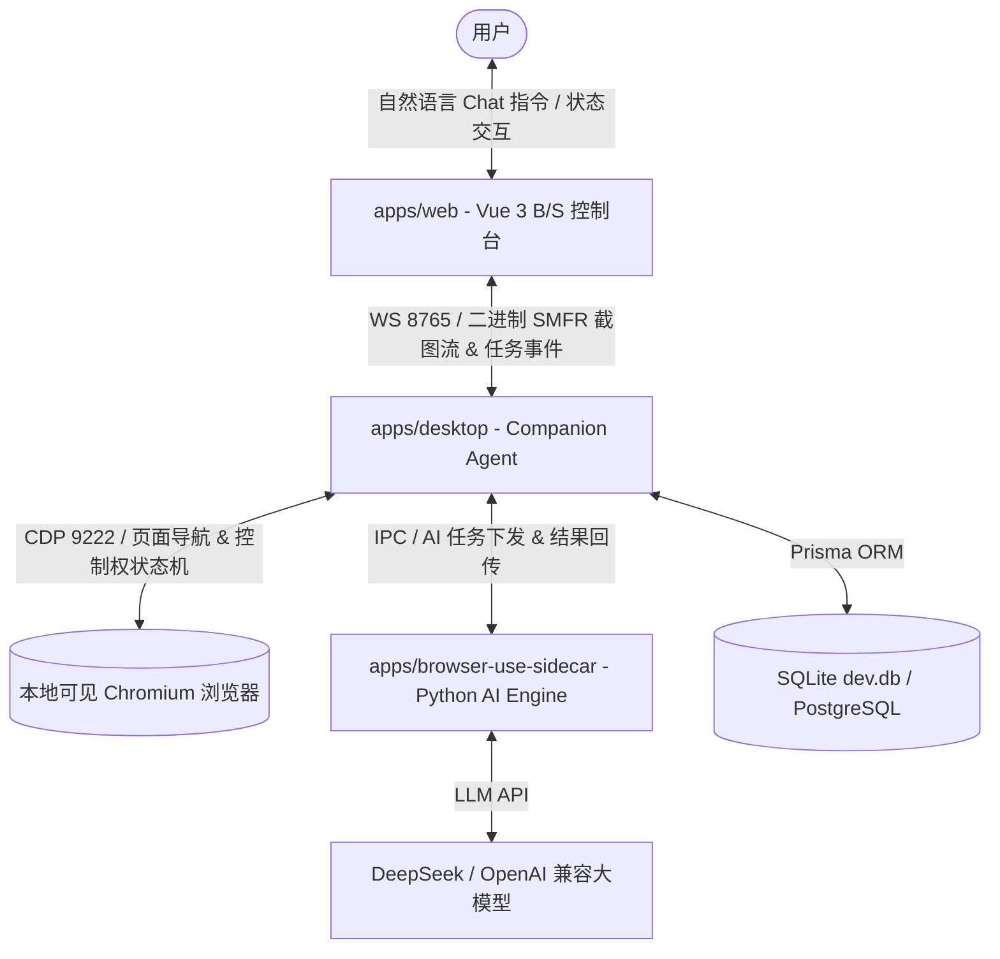

# 🚀 Smart-Form — 智能表单采集与填报通用系统

<p align="center">
  
  
  
  
  
  
</p>

> **Smart-Form** 是一套现代化、本地优先（Privacy First）的智能表单采集与填报通用系统。系统采用 **TypeScript Monorepo + Python Sidecar** 的三层解耦架构，结合 **Browser Use AI** 大模型语义识别与 **Win32 原生窗口抢占接管** 机制，为复杂第三方网页与企业内部表单提供全自动、高可用、可复用的智能采集与填报方案。

---

## 🌟 核心特性 (Key Features)

- 🎨 **三栏全景可视化控制台**
  - 基于 Vue 3 + Vite 构建的标准 B/S 产品首页，集成 **Chat 对话指引**、**中栏画面推流** 与 **右栏执行过程与步骤明细**。
- 📺 **单向安全画面推流 (Screencast)**
  - 基于二进制 `SMFR` 自定义传输协议，通过 WebSocket 实时推流 2~5 FPS 高清只读画面；前端带有 `pointer-events: none` 强隔离防护，彻底防止远程点击注入。
- 🤖 **Browser Use AI 智能语义提取**
  - 结合 DeepSeek / LLM 大模型进行动态 DOM 语义推演，不依赖特定硬编码选择器。支持动态解析自然语言中的目标数量（如 *前10条*），并智能过滤顶部/底部普通导航菜单噪音。
- 🚨 **抢占式 Win32 人机协作接管 (Human-in-the-Loop)**
  - 当目标站点触发滑块验证码、MFA 或登录保护时，Agent 自动进入 `WAITING_HUMAN` 状态，并通过 Win32 API (`SetForegroundWindow`) **瞬间强行将本地原生 Chromium 窗口弹出至系统最前台**，由用户手工滑动验证后一键恢复。
- 🗄️ **零依赖跨数据库引擎 (Prisma ORM)**
  - 内置支持 **SQLite** 嵌入式文件数据库（本地零依赖、即开即用），并可无缝配置切换至生产级 **PostgreSQL** 或 **MySQL**。

---

## 🏗️ 系统架构图 (Architecture)



---

## 📁 目录结构 (Directory Structure)

```text
smart-form/
├── apps/
│   ├── web/                   # B/S Vue 3 + Vite 三栏统一产品首页 (3000端口)
│   ├── desktop/               # Companion Agent Electron 桌面客户端与状态机
│   ├── server/                # NestJS + Prisma 云端控制面与复用路由 (3000/API)
│   ├── validator-worker/      # TypeScript AST 静态安全扫描 Worker
│   └── browser-use-sidecar/   # Python Browser Use AI 探索引擎与 Spike
├── packages/
│   ├── contracts/             # 共享 TypeScript DTO 接口定义
│   ├── task-schema/           # 任务定义 Zod Schema (mode: read | write)
│   ├── event-schema/          # WebSocket 事件包络 EventEnvelope
│   ├── data-profile/          # 数据源 Schema 与安全转换引擎 (防 eval 注入)
│   ├── explore-core/          # Action Trace 规范化与 Playwright 编译器
│   ├── capability-sdk/        # 能力包组装、SHA-256 校验、FillerContext 与 PageSafetyProxy
│   ├── playwright-runner/     # CDP 模式 Playwright 独立回放引擎
│   └── policy-engine/         # 域名访问策略与越权防护引擎
├── tests/
│   └── sites/                 # 3 大场景 Mock 测试靶场 (8080端口)
├── .env.sqlite.example        # SQLite 选型环境变量模板
├── .env.postgre.example       # PostgreSQL 选型环境变量模板
└── pnpm-workspace.yaml        # Monorepo Workspace 配置
```

---

## ⚡ 快速开始 (Quick Start)

### 1. 基础环境要求
- **Node.js** `>= 20.0.0`
- **pnpm** `>= 9.0.0`
- **Python** `>= 3.11` 与 **uv** 工具链

### 2. 安装依赖与构建

```bash
# 1. 安装全仓 TypeScript 依赖
pnpm install

# 2. 初始化 Python Sidecar 环境
cd apps/browser-use-sidecar
uv sync
cd ../..

# 3. 编译全仓所有 Workspace 子项目
pnpm build
```

---

## 🚦 本地调试与运行 (Development Workflow)

启动完整工程建议并行运行以下终端：

### 终端 1：启动 3 大 Mock 测试靶场 (8080 端口)
```bash
pnpm dev:sites
```
*提供普通表格 (`table.html`)、动态分页 (`pagination.html`) 与列表详情 (`detail.html`) 基准。*

### 终端 2：启动 B/S 三栏统一产品首页 (3000 端口)
```bash
pnpm dev:web
```
*浏览器访问 `http://localhost:3000` 进入三栏全景可视化控制台。*

### 终端 3：启动本地 Agent 引擎与防频闪推流
```bash
uv run --directory apps/browser-use-sidecar python spike/02_screenshot_stream.py
```

---

## 💡 示例指令 (Example Prompts)

在控制台左侧 Chat 框中直接体验（支持点击预置按钮一键填入）：

### 🔍 1. 数据采集示例 (Read Mode)

1. **测试靶场采集**：
   > `请帮我采集 http://localhost:8080/table.html 中的所有采购项目与预算金额`
2. **通用博客数据提取**：
   > `采集 https://www.cnblogs.com/ 的前10条信息`
3. **电商商品优惠提取 (含菜单自动过滤)**：
   > `采集 https://www.smzdm.com 的前10条商品信息，不要采集到普通菜单`

---

### ✍️ 2. 智能表单填报示例 (Write Mode)

1. **标准采购表单填报 (测试靶场沙箱)**：
   > `请使用标准采购数据源，帮我填报 http://localhost:8080/fill-form.html`
   *说明：系统将自动切换至 write 填报模式，读取 `DataSourceStore` 中的采购 Profile，在测试靶场页面中自动填充申请人、项目名称、采购类别与预算金额。在点击最终提交前，前端将强弹窗进入 `WAITING_APPROVAL_SUBMIT` 二次高危确认阶段，经用户审查点击授权后完成提交回执存根。*

2. **自定义命令行数据填报**：
   > `使用申请人"李明"，项目名称"AI大模型服务器扩容"，预算"120000"，填报 http://localhost:8080/fill-form.html`

---


## 🔒 隐私与安全红线 (Privacy & Security)

1. **隐私数据留存本地**：用户账号密码、Cookies 与 Session 严格保存在本地 Chromium Profile 中，绝不上发云端。
2. **画面纯只读隔离**：前端界面截图卡片带有 `pointer-events: none` 强隔离防护，彻底防止远程点击注入攻击。
3. **CDP 127.0.0.1 强绑定**：Chrome DevTools Protocol 端口严格监听在 `127.0.0.1` 本地回环。

---

## 📄 许可证 (License)

本项目采用 [MIT License](LICENSE) 开源许可。
