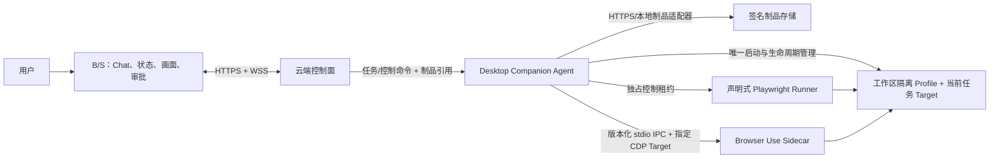

# Smart Form

Smart Form 是一个面向网页数据采集与表单填报的三层系统。当前实现遵循：

- 云端控制面：NestJS、PostgreSQL/Prisma，负责鉴权、任务规划、版本化资源匹配、制品签名、命令路由和状态转发。
- B/S 前端：Vue 3，负责 Chat、任务状态、只读画面和提交审批。
- 本地执行面：Electron Desktop 是设备侧唯一事实源，负责工作区隔离的持久化 Chromium Profile、浏览器生命周期、任务检查点、Runner/Sidecar 互斥调度和离线报告队列。

Sidecar 和 Runner 都不能自行启动浏览器。Desktop 启动一个绑定回环动态端口的 Chromium，Runner 使用受约束的声明式 Playwright 能力包；Browser Use Sidecar 仅能连接 Desktop 指定的 CDP Target，并被限制为读任务。

## 架构



WebSocket 只承载控制消息、状态报告和画面帧，不下发可执行制品正文。能力包在执行前必须通过租户、Ed25519 签名、SHA-256、长度、协议、SDK、Playwright、Node、浏览器和执行模式校验。制品版本不可覆盖；服务端资源支持激活和回滚。

## 安全边界

- 身份使用 OIDC/OAuth 短期 Bearer Token。设备私钥只签署本地验证证据，不作为登录凭据。
- 生产环境必须配置固定的服务端制品公钥；仅回环开发环境允许从本地控制面发现临时公钥。
- 写任务必须匹配已验证的声明式能力包，不能交给 AI Sidecar。
- 最终提交只能通过 `submit` 原语；Runner 会停在 `WAITING_APPROVAL_SUBMIT`，收到匹配的 `APPROVE_SUBMIT` 后才点击。
- Desktop 按 `TENANT_ID + WORKSPACE_ID` 使用持久化独立 Chromium Profile，并独占当前任务 Target；任务、检查点、命令回执和待确认上报保存在本地 SQLite。
- 人工登录/验证码完成后，用户主动恢复；Desktop 重新检查 URL 和活动 Target 后才返还自动化控制权。
- CDP 仅绑定 `127.0.0.1`，端口默认动态分配。

本轮明确未实现敏感页面暂停推流、截图脱敏和“服务端截图仅内存转发”策略；不要把当前 Screencast 链路解释为已具备这些能力。

## 目录

```text
apps/
  server/                 云端控制面、OIDC、资源/制品/任务与 WebSocket
  web/                    Vue B/S 控制台
  desktop/                Electron、Chromium 所有权、编排、检查点与执行器
  browser-use-sidecar/    Python Worker；只接受 Desktop 的版本化 stdio IPC
packages/
  contracts/              TS 端唯一业务与传输契约
  capability-sdk/         签名、完整性、兼容性与能力包策略
  playwright-runner/      声明式 Playwright 执行与提交审批
tests/
  sites/                  本地读/写测试页面
  e2e/                    实际浏览器读/写闭环
```

## 本地验证

要求 Node.js 20+、pnpm 9+、Python 3.11+、uv，以及本机 Chrome。首次安装：

```bash
pnpm install
uv sync --directory apps/browser-use-sidecar
pnpm --filter @smart-form/server exec prisma generate --schema prisma/schema.prisma
```

执行全部质量门禁：

```bash
pnpm lint
pnpm test:coverage
uv run --directory apps/browser-use-sidecar pytest -q
pnpm build
```

测试不使用真实账号、Cookie、生产数据或付费 LLM。`tests/e2e/read-write.e2e.test.ts` 会启动本地 Mock HTTP 服务和无头 Chrome，验证：

1. 签名读能力包在 Desktop 所有的页面中采集两条记录；
2. 写能力包先填表但不提交；
3. 只有明确审批命令到达后才产生 POST，并保存成功检查点。

## 本地开发

复制 `.env.example` 后按需设置环境变量，并分别运行：

```bash
pnpm dev:server
pnpm dev:web
pnpm dev:desktop
```

开发模式默认使用：

- 控制面：`http://127.0.0.1:3001`、`ws://127.0.0.1:3001/ws`
- B/S：Vite 开发地址
- 开发 Token：`smart-form-local-dev-token`
- 服务端资源仓库：内存
- 制品存储：仓库下 `data/artifacts`

若要让未匹配能力包的读任务使用 Browser Use Sidecar，需设置 `BROWSER_USE_API_KEY` 或 `OPENAI_API_KEY`；自动化测试不需要这些凭据。

填报 Chat 示例必须包含明确值：

```text
填报订单，orderNumber=A-202 http://127.0.0.1:8080/write
```

## 生产配置

生产环境会 fail-fast，并至少要求：

- `NODE_ENV=production`
- `HOST`、`PORT`
- `AUTH_MODE=oidc`
- `OIDC_ISSUER`、`OIDC_AUDIENCE`、`OIDC_JWKS_URL`
- `RESOURCE_REPOSITORY=prisma`、`DATABASE_URL`
- `ARTIFACT_TRANSPORT=https`、`ARTIFACT_PUBLIC_BASE_URL`
- `ARTIFACT_SIGNING_KEY_ID`、`ARTIFACT_SIGNING_PRIVATE_KEY_B64`
- Desktop 的 `DEVICE_ACCESS_TOKEN`、`ARTIFACT_SIGNING_PUBLIC_KEYS_JSON`
- Desktop 的 `TENANT_ID`、`WORKSPACE_ID`、`DEVICE_ID`
- Desktop 的 `SIDECAR_EXECUTABLE`、`SIDECAR_WORKING_DIRECTORY` 和可选 `SIDECAR_ARGS_JSON`

数据库迁移位于 `apps/server/prisma/migrations`。部署时使用反向代理终止 TLS，将 HTTPS/WSS 转发到服务端；不要在浏览器 URL、日志或 WebSocket 查询参数中传递 Token。

`apps/browser-use-sidecar/spike/` 仅保留技术验证，不属于生产启动路径。仓库中已有的 `spike-profile-01` 可能包含浏览器认证数据，本次没有擅自删除；应由数据所有者确认后从 Git 历史和工作区安全清理。
