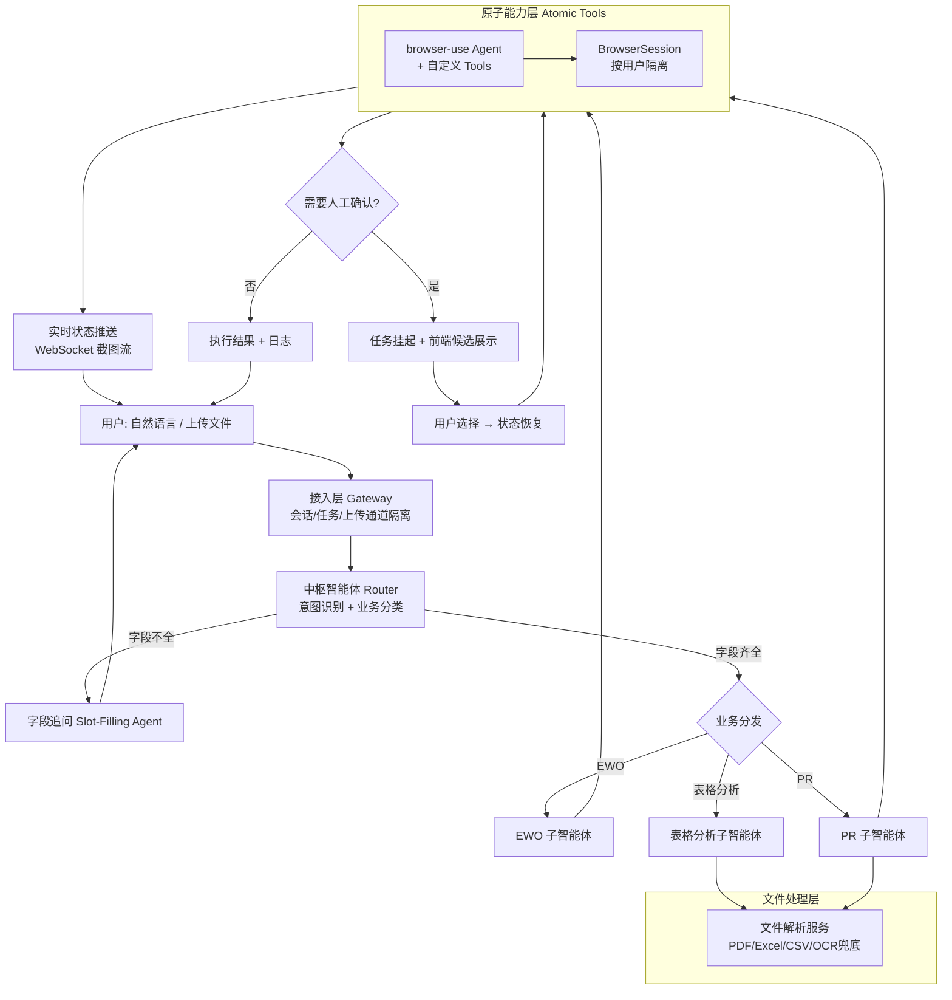
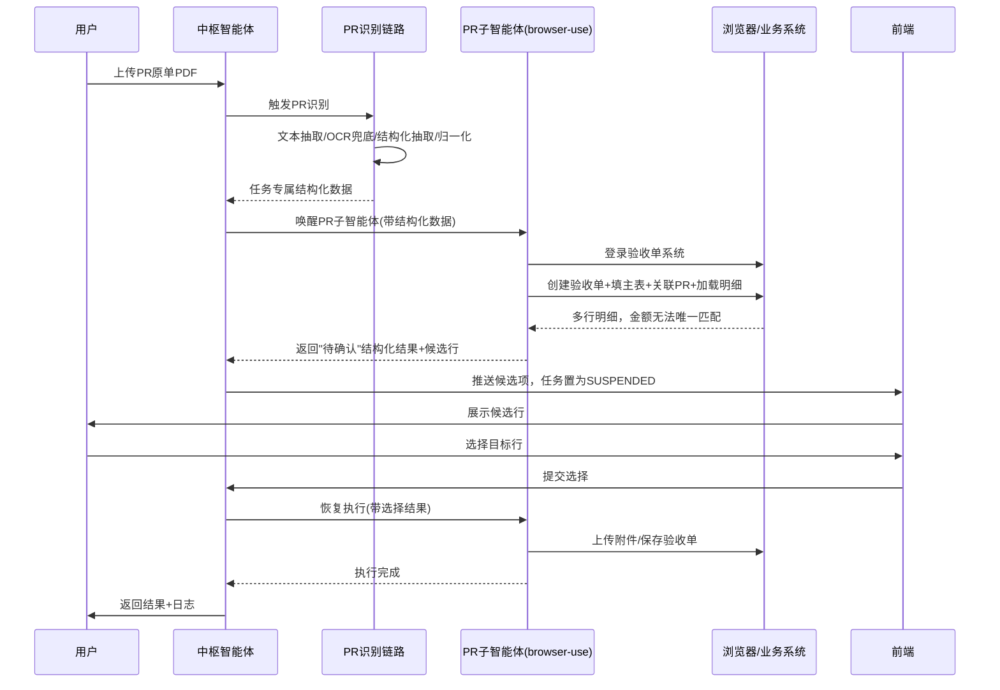

# OxyGent 网页自动化平台工程化设计文档
### ——基于 browser-use 的多智能体企业系统自动填报架构

---

## 一、背景与目标

原始业务描述中的是一个"中枢智能体 + 业务子智能体 + 原子能力"三层结构的自动化填报系统，覆盖 EWO 工单填报、PR 原单识别与验收单生成两条核心业务线，并具备文件隔离、字段追问、实时截图流、人工确认中断等能力。

本设计文档的目标是把这套业务流程，落地成一套**可维护、可扩展、多租户安全**的工程实现，核心自动化执行引擎选用 [browser-use](https://github.com/browser-use/browser-use)（Python，LLM 驱动的浏览器 Agent 框架），配合独立的编排层、字段抽取层、文件解析层和实时通信层。

**设计原则：**
1. **能确定性完成的步骤，不交给 LLM 猜** —— 登录、翻页、重复行填写等用自定义 Tool/固定动作链完成，LLM 只负责需要语义理解和判断的环节（意图识别、字段抽取、异常处理决策）。
2. **会话/任务/租户三级隔离**，避免浏览器上下文、文件、登录态串用。
3. **可中断可恢复**，人工确认节点不是"阻塞等待"，而是把状态落盘后异步恢复。
4. **可观测**，每一步操作、每一次 LLM 决策都要能追溯。

---

## 二、总体架构



**分层职责：**

| 层级 | 职责 | 关键组件 |
|---|---|---|
| 接入层 | 会话/任务/上传通道隔离，请求路由 | Gateway、任务上下文管理 |
| 中枢智能体层 | 意图识别、业务分类、字段完整性校验、追问 | 轻量 LLM 分类调用 + 结构化输出 |
| 业务子智能体层 | 领域知识、页面填写策略、异常处理决策 | browser-use `Agent`（domain system prompt） |
| 原子能力层 | 具体页面操作、文件解析、重复行填写 | browser-use 内置 Tools + 自定义 `@tools.action` |
| 会话管理层 | 浏览器上下文/登录态隔离与复用 | browser-use `BrowserSession` / Profile |
| 实时推送层 | 高频截图流、执行状态推送 | WebSocket / SSE |
| 人工确认层 | 中断-挂起-恢复 | 任务状态机 + 持久化 checkpoint |
| 观测层 | 日志、对话记录、错误追踪 | history 对象、`save_conversation_path` |

---

## 三、核心技术选型说明

### 3.1 为什么用 browser-use 作为原子能力执行引擎

browser-use 本身不是"录制回放"工具，而是 LLM 驱动的浏览器操作 Agent，具备：

- **确定性前置动作**：`initial_actions` 参数可以在不消耗 LLM 推理的情况下执行固定步骤（如登录、跳转到目标菜单），这正好对应文档中"登录 EWO 系统""进入 XX 页面"这类无歧义步骤。
- **自定义 Tool**：`@tools.action` 装饰器允许注册领域特定的确定性动作（比如"批量填写 Change Action 明细行"），把重复性强、容错要求高的操作从 LLM 决策链里剥离出来，直接用代码遍历执行。
- **文件上传支持**：`available_file_paths` 参数让 Agent 能识别页面 file input 并完成上传，直接对应"附件上传""PR 原单上传"环节。
- **敏感信息隔离**：`sensitive_data` 参数确保账号密码不会明文出现在传给 LLM 的上下文里，只在浏览器实际执行时注入真实值。
- **结构化输出**：`output_model_schema` 让每个子智能体的执行结果都能以类型化对象返回，方便编排层做下一步判断（例如"是否需要人工确认多行明细"）。
- **执行可追溯**：`history` 对象提供 `screenshot_paths()`、`action_names()`、`extracted_content()`、`errors()`、`model_actions()` 等方法，`save_conversation_path` 可保存完整 LLM 对话记录，用于审计和调试。

需要明确的是：browser-use **没有**内置的连续视频录制能力（社区在 GitHub Issue #4533 中提出过用 CDP `Page.startScreencast` 实现视频录制的方案，目前仍是开放的功能请求，尚未合并）。文档中要求的"高频截图流推送到前端"，工程上应实现为**独立的截图轮询/CDP screencast frame 推送机制**，与 browser-use Agent 自身每步截图解耦，见 4.8 节。

### 3.2 编排层技术选型

中枢智能体的"意图识别 + 分发"不建议用完整的 Agent 循环去做（成本高、延迟大），而是：
- 用一次结构化输出的 LLM 调用做意图分类 + 字段抽取（Pydantic Schema 定义 EWO/PR/表格分析各自的必填字段集合）
- 分类结果驱动一个**显式状态机 / DAG**（可复用此前"多智能体 DAG 编排"项目中的编排层设计经验），而不是让 LLM 自己决定调用顺序 —— 页面填报流程是强顺序性的（先登录→先创建工单→再填明细→再上传附件），不需要 LLM 做流程规划，只需要它做每一页里的语义判断。

### 3.3 文件解析层技术选型

- 优先走 PDF 文本层直接抽取；文本层不可用（扫描件/复杂版式）时走 OCR 兜底服务（对应文档中的 TextIn 方案），统一输出 Markdown/纯文本供 LLM 结构化抽取。
- 结构化抽取用 Schema 约束输出（申请人、金额、WBS 等字段），并做归一化清洗（字符去空格、大小写统一等），归一化规则应做成可配置的规则表，而不是硬编码，方便后续新增字段或适配新单据格式。

### 3.4 实时推送与人工确认层

- 推送：WebSocket 长连接，按 `task_id` 建立频道，截图轮询/CDP frame 推送到对应频道。
- 人工确认：本质是一个"可中断的状态机节点"。子智能体在多行匹配歧义等场景下，不直接抛错，而是返回结构化的"待确认"结果 + 候选列表，编排层将当前任务状态（含浏览器 session id、已完成步骤、待选项）持久化，前端展示候选，用户选择后编排层带着选择结果恢复执行——**不能用同步阻塞等待**，否则并发用户一多，浏览器实例和 LLM 会话会被无谓占用。

---

## 四、关键模块详细设计

### 4.1 会话与任务隔离设计

隔离维度：`user_id` → `session_id` → `task_id` → `upload_channel`。

- 文件存储路径规范：`/data/{user_id}/{task_id}/{channel}/{filename}`，PR 原单通道与普通附件通道物理隔离，避免"系统只应识别 PR 原单上传通道中的 PDF"这类业务规则在代码层被绕过。
- 浏览器会话：每个 `user_id` 维护独立的 browser-use `BrowserSession`（独立 Profile / `storage_state`），登录态持久化在该 Profile 下，避免不同用户登录态混用；同一用户的并发任务可复用登录态但需要串行化访问同一浏览器 context（用任务队列，而非多任务抢同一个 Page）。
- 任务数据落盘：PR 识别结果等中间数据按 `task_id` 落盘为任务专属数据文件，下游验收单流程只读取本任务文件，杜绝跨任务串数据。

### 4.2 中枢智能体（意图识别与调度）设计

输入：用户自然语言 + 已上传文件的元信息（类型、数量、通道）。

处理：一次结构化输出 LLM 调用，返回：
```json
{
  "business_type": "EWO | PR | TABLE_ANALYSIS | UNKNOWN",
  "entry_mode": "QA | TEMPLATE",   // 仅 EWO 场景，对应"问答式填报/模板式提报"
  "extracted_fields": { "...": "..." },
  "missing_required_fields": ["..."]
}
```
若 `missing_required_fields` 非空，进入追问循环，不唤醒下游子智能体（严格对应文档"字段缺失时进行追问"原则）；字段齐全后按 `business_type` 分发到对应子智能体，并把 `extracted_fields` 作为初始上下文传入，避免子智能体重复问一遍。

必填字段集合按业务类型配置化管理（建议 YAML，与你此前 browser-use demo 项目的 YAML 配置思路保持一致），便于后续新增字段或新业务线时无需改代码：

```yaml
ewo:
  required_fields: [account, password, title_cn, title_en, category, type, priority, reason, dre, date, project]
pr:
  required_fields: []   # PR 走 PDF 识别，字段来自抽取结果
  post_fields: [service_start_time, service_end_time, accept_amount]  # 补填阶段必填
```

### 4.3 EWO 业务子智能体设计

对应一个 browser-use `Agent`，system prompt 中固化 EWO 系统的页面结构知识（各页面 tab 名称、字段位置规律），工具集包括：

- `login_ewo`（走 `initial_actions`，无 LLM 推理）
- `create_ewo_ticket`（填写标题/分类/类型/优先级/原因，走常规 Agent 推理 + `max_actions_per_step` 控制单步动作数）
- `fill_base_information` / `fill_affect_page`（表单字段较固定，可用自定义 Tool + 少量 LLM 判断下拉选项匹配）
- `upload_attachment`（`available_file_paths`）
- `batch_fill_change_action_rows`（**自定义确定性 Tool**：直接读取 Change Action 明细模板解析后的结构化数据，循环调用 Playwright locator 逐行填入，不经过 LLM 逐行推理 —— 这是"模板式提报"场景下最容易出错、也最不需要 LLM 判断的环节）
- `handle_cost_analysis_and_distribution`

问答式填报与模板式提报的差异只体现在**进入子智能体前**：问答式先经过追问循环把字段收集齐，模板式直接解析模板文件填充字段，两条路径汇合到同一套子智能体工具链，避免维护两套自动化逻辑。

### 4.4 PR 业务子智能体设计

拆成两个阶段，分别对应文档中的"PR 原单识别"和"验收单自动创建"：

**阶段一：PR 识别**（不涉及浏览器操作，纯文本处理链路）
1. 文件通道判定（只取 PR 原单通道 PDF）
2. PDF 文本抽取 → 文本不足时 OCR 兜底
3. LLM 结构化抽取（Schema 约束）
4. 字段归一化（规则表驱动）
5. 落盘为任务专属数据文件

**阶段二：验收单创建**（browser-use Agent 执行）
1. 读取阶段一产出的任务数据
2. `login_acceptance_system`（`initial_actions`）
3. `fill_main_form`（项目标题/类别/采购类型等，来自结构化数据直接映射，非 LLM 猜测）
4. `select_org_and_wbs`（下拉搜索选择，需要 LLM 语义匹配，因为 WBS 搜索结果可能有多个近似项）
5. `link_pr_document` + `load_detail_lines`
6. `match_detail_lines_by_amount`（**关键的人工确认触发点**）：优先按金额自动匹配，匹配失败时返回结构化"待确认"结果，触发 4.9 节的中断-恢复机制
7. `upload_pr_and_attachments`
8. `save_acceptance_form`
9. `fill_service_time_and_amount`（缺字段则追问，不允许 LLM 自行推断替代，这一条是文档明确写出的硬约束，必须在子智能体 system prompt 和 Tool 层双重兜底：Tool 层校验必填字段是否存在，缺失直接返回"需追问"而不是让 LLM 编造）

### 4.5 网页自动化原子能力层（browser-use 落地细节）

将文档"四、网页自动化支撑流程"中列出的原子动作与 browser-use 能力逐一对应：

| 业务描述的原子动作 | browser-use 落地方式 |
|---|---|
| 打开页面 / 点击按钮 / 输入文本 | 内置浏览器操作 Tool，LLM 按视觉/DOM 状态决策 |
| 等待加载 | `step_timeout` 调优 + 页面状态变化检测，动态表单建议调低 `max_actions_per_step` 使 Agent 更频繁重新读取页面 |
| 下拉选择 / 勾选 | 内置 Tool，对语义模糊的下拉（如 WBS 搜索）保留 LLM 判断，对固定选项下拉可用自定义 Tool 直接按值匹配 |
| 上传附件 | `available_file_paths` |
| 切换标签页 | 内置多标签页识别与切换能力 |
| 记录执行状态 | `history` 对象 + 自定义 step callback（每步执行后回调，写入执行状态表） |
| 推送网页状态 | 独立于 Agent 主循环的截图轮询/CDP screencast，见 4.8 |
| 人工确认候选展示 | 4.9 节中断机制 |

**容错策略：**
- `max_failures` 控制单步重试次数，配合业务分类设置不同容忍度（EWO 表单填写容错可稍高，PR 明细金额匹配这类涉及财务数据的操作容错应更严格，失败即转人工确认而非重试）。
- 所有自定义 Tool 内部要做**幂等性设计**（比如重复行填写前先检查是否已存在该行，避免重试导致重复提交）。

### 4.6 实时状态推送设计

不复用 Agent 自身逐步截图机制（那是给 LLM 自己看的、频率受限于推理步数），单独起一个后台任务：
- 方案 A（简单）：固定间隔（如 500ms-1s）调用 `page.screenshot()`，编码后通过该 `task_id` 的 WebSocket 频道推送。
- 方案 B（更平滑）：接入 CDP `Page.startScreencast` / `screencastFrame` 事件，帧到达即推送，视觉连续性更好，但需要额外处理帧率限制和资源开销。

建议先上方案 A 快速验证前端展示效果，观察带宽和用户体验后再评估是否切换方案 B。

### 4.7 人工确认/中断恢复机制设计

任务状态机需要显式的"挂起态"：

```
RUNNING → (触发歧义/需追问) → SUSPENDED(checkpoint持久化) → (用户输入) → RUNNING → ... → DONE / FAILED
```

Checkpoint 需要持久化的内容：`task_id`、浏览器 `session_id`（浏览器 context 本身不销毁，只是暂停调度）、已完成步骤列表、候选项数据、当前子智能体类型。用户在前端选择候选项后，编排层把选择结果作为参数注入下一次子智能体调用（不是重新跑一遍前面的步骤）。

这个机制同时服务于文档里提到的两类中断场景：字段追问（中枢智能体层面）和多行明细选择（子智能体层面），建议做成**通用的中断/恢复基础设施**，而不是各业务线各写一套。

### 4.8 日志、观测与容错设计

- 每个子智能体运行用 `save_conversation_path` 落盘完整 LLM 对话，用于审计"为什么 Agent 做了这个决策"。
- `history.errors()`、`history.action_names()` 等结构化信息写入统一的执行日志表，按 `task_id` 可查询。
- 关键财务/审批类操作（PR 验收金额确认等）建议额外记录操作前后的页面截图，作为审计凭证。

---

## 五、关键时序图（以 PR 验收单创建为例）



---

## 六、非功能性设计要点

| 维度 | 要求 | 落地方式 |
|---|---|---|
| 安全 | 账号密码不进入 LLM 上下文 | browser-use `sensitive_data` 参数 |
| 多租户隔离 | 文件/浏览器会话/任务数据三级隔离 | 4.1 节路径与 Session 规范 |
| 并发 | 浏览器实例资源可控 | 每用户独立 BrowserSession + 实例池上限 + 任务队列串行化 |
| 可恢复性 | 挂起任务不丢状态 | Checkpoint 持久化到数据库，非内存态 |
| 可观测性 | 全链路可追溯 | LLM对话记录 + 执行日志 + 关键节点截图存档 |
| 成本 | 减少不必要的 LLM 推理 | 固定流程用 `initial_actions`/自定义 Tool，仅语义判断环节用 LLM |

---

## 七、兜底机制设计（Fallback & Degradation Design）

原设计中"风险与应对"只列到了策略层面，这一节把每一类失败场景拆到**检测方式、兜底动作、升级路径**三层，作为工程实现的直接依据。

### 7.1 设计原则

1. **分级兜底，而不是无限重试**：自动重试（同层解决）→ 降级执行（换一种更慢但更稳的方式）→ 人工介入（转交决策）→ 任务显式失败（可追溯、可重新发起）。任何一层达到重试上限就必须进入下一层，禁止在同一层死循环。
2. **兜底不能引入新的不一致**：涉及写操作（创建工单、保存表单、金额确认）的兜底必须先做状态校验（查重/查最终状态），幂等性优先于"重试到成功"。
3. **不允许静默失败**：每一次兜底触发都必须产生一条可观测事件（日志+告警），哪怕最终自动恢复成功了，也要留痕，用于后续统计"哪类问题频发"。
4. **兜底路径本身要比主路径更可靠**：比如"降级为纯视觉/语义定位"要用 browser-use 通用 Agent 能力兜底自定义 Tool 的失败，而不是用另一套更复杂的自动化逻辑去兜底。

### 7.2 页面结构变更监控与兜底（重点）

这是自动化系统最常见也最难提前预知的失效来源——业务系统（EWO/验收单系统）改版、字段位置调整、新增校验弹窗，都会让原本稳定跑的 Tool 突然失效。设计分主动监控和被动兜底两条线：

**（1）主动监控——上线前 / 定时巡检**

- 建立一套**冒烟测试集**：覆盖登录、创建工单、进入各关键页面、定位各关键字段元素这几个最基础的动作，不做真实提交，只验证"元素还在不在、结构有没有变"。
- 巡检频率：每日定时跑一次 + 每次业务系统有已知发版窗口时额外跑一次。
- 巡检产出**结构快照**（关键元素的选择器命中情况、DOM 关键节点 hash），与上一次成功快照做 diff，命中率下降或 hash 变化超过阈值即触发告警，**在没有真实用户任务失败之前就先发现问题**。

**（2）被动兜底——生产执行时的实时降级**

- 每个确定性 Tool（比如"批量填写 Change Action 明细行"里定位表格行/单元格的逻辑）都要记录**选择器命中成功率**的滑动窗口统计。
- 当某个 Tool 在短时间窗口内（如最近 10 次调用）失败率超过阈值（如 >30%），系统自动触发两件事：
  a. **自动降级**：该步骤从"确定性 Tool 直接定位"切换为"调用通用 browser-use Agent，靠视觉/DOM 语义理解去完成同一个动作"——牺牲一些速度和 token 成本，换取任务能继续跑完，不因为一个选择器失效就整条流程中断。
  b. **开出结构变更工单**：带上失败时的页面截图、DOM 快照、历史选择器配置，推给工程侧排查，而不需要等用户投诉。
- 降级模式跑通后，**不自动把降级路径设为新常态**，而是等工程侧确认新的稳定选择器、更新配置并灰度验证后，再切回确定性 Tool——避免"降级模式"因为更贵更慢被长期忽略去优化。

**（3）配置外置与热更新**

- 所有页面选择器 / 字段映射关系放在外部配置（不写死在代码里），格式与现有 YAML 配置体系保持一致。
- 配置变更走小范围灰度：新配置先应用在少量任务上验证通过，再全量切换，避免一次错误配置放大成批量失败。

### 7.3 分场景兜底一览表

| 失败场景 | 检测方式 | 兜底动作（第一层） | 升级路径（兜底仍失败时） |
|---|---|---|---|
| 页面结构变更导致选择器失效 | 滑动窗口失败率统计 + 定时冒烟巡检 diff | 自动降级为通用 Agent 视觉/语义定位继续执行 | 开结构变更工单给工程；任务本身继续跑，不阻塞用户 |
| LLM 返回不合法结构化输出 | Schema 校验失败 | 有限次数重试（可附带错误信息做 self-repair） | 转人工复核队列，附带原始 LLM 输出 |
| Agent 连续动作失败（`max_failures` 触顶） | browser-use 内置失败计数 | 停止当前步骤，截图+错误日志入队 | 转人工排查队列，任务置为 FAILED（非静默丢弃） |
| 关键财务字段抽取结果可疑（金额格式异常/合计不平） | 规则校验（正则、合计校验） | 不直接采信，标记"待复核" | 转人工确认节点（复用 4.7 中断机制），而不是硬填后继续 |
| PDF 文本抽取字数不足 | 抽取字符数阈值判断 | 自动切换 OCR 兜底 | OCR 置信度仍低 → 转人工补录关键字段 |
| 归一化规则匹配不到 | 规则表无命中 | 保留原始值，标记"待人工复核" | 不阻塞主流程，随任务结果一并提示用户核实 |
| 页面加载超时 | 请求/渲染超时 | 有限次数刷新重试，区分网络抖动与业务报错页 | 识别到业务系统错误页特征 → 直接转人工，禁止在错误页反复操作 |
| 业务系统维护中/报错 | 错误页特征识别 | 立即停止当前任务的自动化尝试 | 转人工，记录"系统不可用"原因，允许用户稍后重新发起 |
| 浏览器实例崩溃 | 进程/连接异常检测 | 自动重建实例，从最近 checkpoint 恢复 | 连续重建失败 → 该用户任务转人工，告警基础设施层 |
| 登录态失效 | 操作返回登录页特征 | 自动用 `sensitive_data` 重新走登录流程 | 重新登录仍失败（密码过期/账号锁定）→ 立即转人工，**禁止反复重试**（避免触发账号锁定） |
| 人工确认长时间未处理 | 挂起任务 SLA 计时 | 分级提醒（先提醒用户，超时再提醒管理员） | 超过最大等待时间 → 任务标记"已过期"，释放浏览器资源，数据保留可重新触发 |
| 写操作后网络超时，提交结果不确定 | 提交后无响应/超时 | 查询业务系统当前状态确认是否已提交成功 | 状态无法确认 → 转人工核实，**禁止无脑重试导致重复提交** |
| LLM 服务不可用（限流/鉴权/余额/5xx） | 调用异常类型判断 | 切换至备用 LLM（browser-use `fallback_llm`，主模型耗尽重试后自动切换） | 主备均不可用 → 任务转纯人工排队模式，前端明确提示用户当前处于降级状态 |
| 并发写冲突（同一 WBS/PR 单号被两个任务同时处理） | 提交前二次查询目标对象最新状态与任务本地缓存状态是否一致 | 检测到冲突直接拒绝提交（乐观锁思路），不做"谁先谁赢"的隐式覆盖 | 转人工判断：是重复任务需要合并处理，还是两个独立单据被误关联到同一对象 |
| 文件上传被目标系统拒绝（格式/大小超限/内容拦截） | 上传后页面错误提示识别 | 按错误类型做可修正处理（如超限文件自动压缩后重传一次） | 不可自动修正（格式不支持/内容被拦截）→ 转人工，提示用户重新提供符合要求的文件 |

### 7.4 统一异常事件总线与分级告警

所有兜底触发都不应该分散在各业务子智能体里各自处理告警，而是发一个标准化异常事件（`task_id`、失败类型、发生层级、上下文快照）到统一事件总线，按类型路由：

- **自动重试队列**：网络抖动、临时超时类，系统自己消化，不打扰人。
- **人工复核队列**：数据可信度存疑但未落库（字段抽取可疑、多行匹配歧义），需要业务人员确认后才能继续。
- **工程排查队列**：结构变更、Tool 失败率异常，需要工程介入更新配置或代码。

告警分级：

- **P0（数据风险）**：写操作结果不确定、可能已产生脏数据 —— 需要立即人工核实，触发即时通知（IM/短信）。
- **P1（任务失败，无脏数据风险）**：任务本身失败但未落库或已回滚，用户可重新发起 —— 进入常规待办队列。
- **P2（降级运行中）**：结构变更导致自动降级，任务仍在正常完成，只是走了更慢的路径 —— 进入工程排查队列，不触发即时告警，按天汇总。

这套分级机制的核心是**把"任务还能不能自动跑完"和"需不需要立刻叫醒人"这两个问题分开判断**——很多兜底触发（比如自动降级成功）根本不需要打扰任何人，只有真正涉及数据风险或任务彻底跑不动的场景才升级告警。

### 7.5 兜底效果可观测性（运维视角）

兜底机制设计完不等于结束——如果没人知道"降级模式这周被触发了多少次""哪个 Tool 的失败率在持续上升"，兜底就只是把故障从"任务失败"变成"悄悄跑得很慢"，问题依然会在某个临界点集中爆发。需要一个独立于业务日志的**兜底运维视图**：

- **按 Tool / 按页面维度的健康度趋势**：每个 Tool 的成功率、降级触发次数、平均恢复耗时，按天/周趋势展示，用于识别"正在缓慢劣化但还没跌破告警阈值"的 Tool，提前介入而不是等它真正跌破阈值才处理。
- **降级模式运行时长统计**：某个 Tool 处于"降级为通用 Agent 定位"状态累计运行了多久、覆盖了多少任务——这个指标应该直接关联到工程排查队列的优先级排序，降级时间越长、影响任务数越多，修复优先级越高。
- **P0/P1/P2 事件量趋势与 SLA 达成率**：P0（数据风险类）从触发到人工处理完成的平均时长是否在可接受范围内，是验证"兜底机制是否真正被响应"而不只是"设计上存在"的关键指标。
- **结构变更工单闭环率**：主动巡检/被动降级开出的结构变更工单，有多少在合理时间内被修复并重新切回确定性 Tool——避免降级路径被长期依赖而无人回头优化。

这个视图建议做成一个独立的运维 Dashboard（而不是混在业务任务日志里），服务对象是工程/运维人员而非业务用户，是判断"这套自动化系统是否健康"的第一入口。

---

## 八、工程化工作任务分解（WBS）

### 阶段 0：技术验证（1-2周）
- [ ] browser-use 在目标 EWO/PR/验收单系统上做登录、表单填写、文件上传的最小可行验证（POC），确认页面结构是否有强反自动化机制
- [ ] 验证多标签页、动态加载表单在真实业务系统上的稳定性
- [ ] PDF 抽取 + OCR 兜底方案在真实 PR 原单样本上的准确率评估
- **产出物**：POC 报告、风险清单

### 阶段 1：基础设施层（2-3周）
- [ ] 会话/任务/上传通道三级隔离的存储路径规范与实现
- [ ] `BrowserSession` 按用户隔离的 Profile 管理（含登录态持久化）
- [ ] 任务状态机基础设施（RUNNING/SUSPENDED/DONE/FAILED + Checkpoint 持久化）
- [ ] WebSocket 推送通道（按 task_id 建频道）
- **产出物**：可复用的隔离层、状态机 SDK，供各业务子智能体调用

### 阶段 2：中枢智能体（1-2周）
- [ ] 意图识别 + 字段抽取的结构化输出 Prompt 与 Schema 设计
- [ ] 各业务线必填字段配置化（YAML）
- [ ] 追问循环的多轮交互实现
- **产出物**：中枢智能体服务，可独立测试意图分类准确率

### 阶段 3：文件解析层（1-2周，可与阶段2并行）
- [ ] PDF 文本抽取 + OCR 兜底集成
- [ ] LLM 结构化抽取 Schema（PR 各字段）
- [ ] 字段归一化规则表（可配置）
- **产出物**：独立可调用的文件解析服务

### 阶段 4：EWO 子智能体（2-3周）
- [ ] 登录/创建工单/基础信息/影响信息页面的 browser-use Tool 开发
- [ ] Change Action 明细批量填写自定义 Tool（重点：幂等性设计）
- [ ] 附件上传、Cost Analysis、Distribution 页面处理
- [ ] 问答式/模板式两种进入方式的字段汇合逻辑
- **产出物**：EWO 端到端可跑通，含异常场景（字段缺失、页面元素未找到）处理

### 阶段 5：PR 子智能体（2-3周）
- [ ] 验收单主表填写、组织/WBS 选择 Tool
- [ ] 多行明细金额匹配逻辑 + 人工确认中断触发
- [ ] 附件上传、保存、服务时间/金额补填流程
- **产出物**：PR 端到端可跑通，含人工确认闭环验证

### 阶段 6：实时推送与前端联调（1-2周）
- [ ] 截图轮询/推送后台任务
- [ ] 前端候选项展示与用户选择回传接口
- [ ] 挂起/恢复的前后端联调
- **产出物**：用户可实时看到 Agent 操作过程，可对多行明细做人工选择

### 阶段 7：观测与容错加固（2-3周，对应第七章兜底设计落地）
- [ ] 统一执行日志表、LLM 对话审计存档
- [ ] 关键节点截图存档（PR 金额确认等）
- [ ] 各 Tool 的重试策略与幂等性回归测试
- [ ] 冒烟测试集开发 + 定时巡检任务（结构快照 diff 告警）
- [ ] Tool 级选择器失败率滑动窗口统计 + 自动降级到通用 Agent 定位的开关逻辑
- [ ] 选择器/字段映射配置外置化改造 + 灰度发布机制
- [ ] 统一异常事件总线（P0/P1/P2 分级路由到重试/人工复核/工程排查三类队列）
- [ ] `fallback_llm` 主备模型切换配置与联调
- [ ] 登录态失效检测与自动重登流程（含防止反复触发账号锁定的限流保护）
- [ ] 写操作幂等 key 设计规范落地 + 并发写冲突检测（乐观锁）
- [ ] 兜底运维 Dashboard（Tool健康度趋势、降级时长统计、P0/P1/P2 SLA达成率、结构变更工单闭环率）
- **产出物**：可追溯任意任务的完整执行链路；具备结构变更自愈能力的自动化系统，而非"改版即宕"；工程侧可主动发现劣化趋势而非被动等待故障

### 阶段 8：测试与灰度上线（2周+）
- [ ] 真实业务系统的回归测试（含业务系统页面结构变更的适应性测试）
- [ ] 并发压测（多用户同时发起任务）
- [ ] 小范围灰度，收集失败案例迭代 Tool 与 Prompt
- **产出物**：灰度上线报告、问题清单与迭代计划

---

## 九、主要风险与应对

下表为高层风险摘要，每一项的检测方式、兜底动作、升级路径详见第七章。

| 风险 | 影响 | 应对策略 |
|---|---|---|
| 业务系统页面结构变更导致 Tool 失效 | 自动化中断 | 关键选择器/流程做配置化而非硬编码，主动巡检 + 被动失败率监控自动降级（详见 7.2） |
| LLM 在重复行填写场景幻觉/漏填 | 数据错误，财务风险 | 重复行操作全部走确定性自定义 Tool，不依赖 LLM 逐行判断；金额类字段额外做规则校验（详见 7.3） |
| 多用户并发导致浏览器资源耗尽 | 系统不可用 | 实例池上限 + 排队机制 + 监控告警 |
| 人工确认挂起任务长期未处理 | 资源占用/数据陈旧 | 挂起任务设置 SLA 与分级提醒，超时自动过期释放资源（详见 7.3） |
| 敏感数据（账号密码/金额）泄露到 LLM 日志 | 安全合规风险 | `sensitive_data` 隔离 + 日志脱敏审计 |
| 写操作网络超时导致重复提交 | 数据一致性风险 | 提交后查询最终状态确认，禁止无脑重试（详见 7.3） |
| LLM 服务不可用 | 全流程阻塞 | `fallback_llm` 主备切换，全不可用则转纯人工排队（详见 7.3） |
| 并发任务写冲突 / 文件被目标系统拒收 | 数据覆盖风险 / 任务卡在文件环节 | 提交前状态核对+乐观锁拒绝隐式覆盖；上传失败按错误类型区分自动修正与人工兜底（详见 7.3） |
| 兜底机制"设计了但没人响应" | 降级路径长期依赖，问题延迟暴露 | 独立运维 Dashboard 跟踪降级时长、SLA 达成率、工单闭环率（详见 7.5） |

---

*本文档基于提供的 OxyGent 业务流程描述，结合 browser-use 技术特性设计，实际落地时建议先完成阶段 0 POC 验证目标业务系统的自动化可行性后，再按 WBS 排期推进。*
