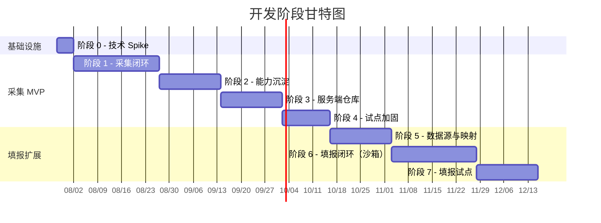
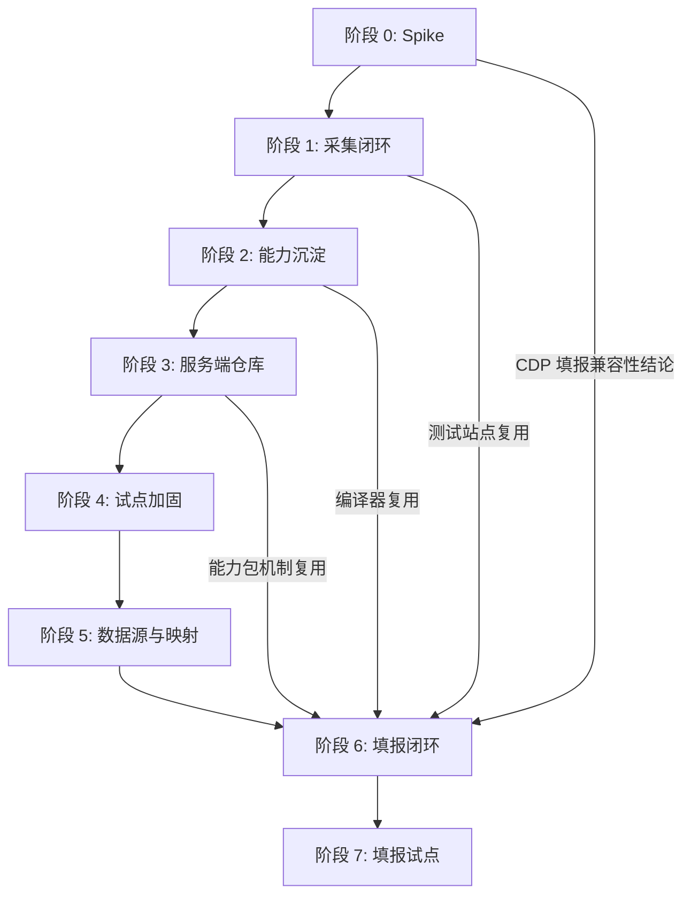

# 智能表单采集与填报系统 — 详细开发计划

> 基于 [智能表单采集与填报系统-设计文档.md](file:///d:/AI/Code/smart-form/智能表单采集与填报系统-设计文档.md) 制定
> 总周期预估：18～23 周（阶段 0～4 为采集 MVP，阶段 5～7 为填报扩展）

---

## 总览

---

## 阶段 0：技术 Spike（3～5 天）

> **定位**：门禁阶段。不通过则不进入阶段 1。不建 Monorepo，用最简工程验证核心假设。

### 0.1 Browser Use + CDP + Chromium 连接验证（1 天）

| 任务 | 产出 | 验收标准 |
|---|---|---|
| 搭建最简 Python 脚本，运行 Browser Use Agent | 可运行的 Python 脚本 | Agent 能在本地可见 Chromium 中完成导航、点击、文本提取 |
| 验证 Browser Use 通过 OpenAI 兼容协议调用 DeepSeek | LLM 调用日志 | 工具调用与结构化事件完成 Schema 校验 |
| 验证 CDP 连接方式：`Playwright.connectOverCDP` | CDP 连接测试脚本 | Agent 锁定任务专属 Browser Context 和 Page，不误操作其他页面 |
| **验证 CDP 模式下模拟输入能否触发 React/Vue 受控组件的 change 事件** | 测试报告 | 对 React 受控 input、Vue v-model input、原生 input 三种情况给出明确结论 |

### 0.2 截图流 + WebSocket 转发验证（1 天）

| 任务 | 产出 | 验收标准 |
|---|---|---|
| 客户端侧：用 Node.js 脚本通过 CDP Screencast 或 Playwright 截图采集帧 | 截图采集脚本 | 2～5 FPS，页面无变化时降频 |
| 搭建最简 WebSocket 服务器转发截图帧 | WS 转发脚本 | 二进制帧正确转发 |
| 搭建 50 行 HTML 页面接收并展示截图流 | 静态 HTML | 画面延迟可接受（p95 < 500ms），不能注入任何输入事件 |

### 0.3 控制权切换验证（0.5 天）

| 任务 | 产出 | 验收标准 |
|---|---|---|
| 验证 Electron 或 Node 脚本将 Chromium 原生窗口切到前台 | 窗口管理脚本 | p95 < 1s 切到前台 |
| 验证 Agent 暂停 → 人工操作 → Agent 恢复的控制权切换 | 手动测试记录 | 切换期间无并发输入，恢复前重新探测页面状态 |
| 验证 Agent 不能操作其他 Profile 或非任务页面 | 隔离测试记录 | Agent 无法访问客户端本地界面或其他 Profile |

### 0.4 Playwright Runner 基础验证（0.5 天）

| 任务 | 产出 | 验收标准 |
|---|---|---|
| 在同一 Chromium 页面上用 Playwright Runner 执行基础 Locator 和提取 | Playwright 测试脚本 | `getByRole`、`getByLabel` 等定位器正常工作 |
| 验证 Browser Use 与 Playwright Runner 在同一浏览器上的控制权切换 | 切换日志 | 无死锁、无 CDP Session 冲突 |

### 0.5 Monorepo 共享类型验证（0.5 天）

| 任务 | 产出 | 验收标准 |
|---|---|---|
| 用 pnpm workspace 搭建最简 monorepo 骨架 | 工程模板 | `packages/contracts` 中的类型可在 `apps/web`、`apps/desktop`、`apps/server` 三处编译引用 |
| 验证 `mode: 'read' \| 'write'` 类型定义的共享 | 类型定义文件 | read/write 通用接口可行 |

### 0.6 Spike 总结与决策（0.5 天）

| 任务 | 产出 |
|---|---|
| 汇总所有验证结果，生成 Spike 报告 | `docs/adr/spike-report.md` |
| 对 CDP 填报兼容性问题给出明确结论 | 结论写入报告 |
| 决策：是否进入阶段 1 | Go / No-Go 决定 |

> [!IMPORTANT]
> 阶段 0 不建完整 Monorepo，不写业务代码。所有验证用独立脚本完成。
> CDP 填报兼容性结论将直接影响阶段 5～7 的技术方案（可能需要非 CDP 模式的备选）。

---

## 阶段 1：采集闭环（3～4 周）

> **目标**：在 3 个受控测试站点完成"Chat 定义任务 → 探索 → 采集 → 人工登录接管 → 数据导出"完整闭环。

### 1.1 Monorepo 工程搭建（2 天）

| 任务 | 涉及目录 | 说明 |
|---|---|---|
| 初始化 pnpm workspace + TypeScript 配置 | `/` | `pnpm-workspace.yaml`、`tsconfig.base.json`、ESLint、Prettier |
| 创建 `packages/contracts` | `packages/contracts/` | 共享 DTO、事件、消息类型的骨架 |
| 创建 `packages/task-schema` | `packages/task-schema/` | 任务定义 Schema（含 `mode: read \| write`），Zod + JSON Schema |
| 创建 `packages/event-schema` | `packages/event-schema/` | 事件包络、事件类型枚举 |
| 配置 CI 基础流水线 | `.github/workflows/` 或等效 | TypeScript 编译检查、Lint、单元测试 |

### 1.2 受控测试站点搭建（2 天）

| 任务 | 涉及目录 | 说明 |
|---|---|---|
| 搭建 3 个测试站点模拟页面 | `tests/sites/` | 覆盖：普通表格、分页列表、列表+详情 |
| 每个站点包含：登录页、数据列表页、详情页 | `tests/sites/` | 模拟登录态过期、验证码、DOM 轻微改版 |
| 提供本地 dev server 启动脚本 | `tests/sites/package.json` | `npm run dev` 一键启动所有测试站 |

### 1.3 Companion Agent 桌面客户端（5 天）

| 任务 | 涉及目录 | 说明 |
|---|---|---|
| Electron 最小壳：托盘图标、窗口管理 | `apps/desktop/src/tray/` | `nodeIntegration=false`, `contextIsolation=true` |
| 设备绑定与在线状态上报 | `apps/desktop/src/main/` | 生成设备 ID，通过 WSS 上报心跳 |
| Chromium 启动管理：独立 Profile、CDP 绑定 127.0.0.1 | `apps/desktop/src/agent/` | `profiles/{tenantId}/{workspaceId}` 目录管理 |
| 截图采集模块：CDP Screencast + 自适应帧率 | `apps/desktop/src/agent/screenshot.ts` | 2～5 FPS，无变化降频，WebP 压缩 |
| 截图流 WebSocket 上传 | `apps/desktop/src/agent/stream.ts` | 二进制帧格式：taskId + frameSeq + capturedAt + 图像数据 |
| SQLite 本地数据库初始化 | `apps/desktop/src/main/db.ts` | 创建 `local_tasks`、`task_events`、`datasets`、`dataset_records` 等表 |
| 控制权管理模块 | `apps/desktop/src/agent/control.ts` | 状态：`AGENT_CONTROL` / `HUMAN_CONTROL` / `TRANSFERRING`，切换序列实现 |
| "打开本地浏览器"命令处理 | `apps/desktop/src/agent/takeover.ts` | 收到命令后将 Chromium 原生窗口切到前台 |

### 1.4 Browser Use Sidecar 集成（4 天）

| 任务 | 涉及目录 | 说明 |
|---|---|---|
| Python Sidecar 进程管理：启动、停止、健康检查 | `apps/desktop/src/agent/sidecar.ts` | 进程隔离，崩溃重启 |
| Sidecar IPC 协议定义：版本化 JSON Schema 消息 | `apps/browser-use-sidecar/ipc/` | 任务快照输入、结构化事件输出 |
| Sidecar 适配层：Browser Use 动作 → 平台语义事件 | `apps/browser-use-sidecar/adapter/` | 动作提议、动作结果、URL、提取内容 |
| LLM 调用配置：OpenAI 兼容协议 → DeepSeek | `apps/browser-use-sidecar/llm/` | API Key 从主进程注入，不硬编码 |
| 探索预算与限制实现 | `apps/browser-use-sidecar/budget.ts` | 100 步上限、30s 单步超时、30 分钟总时长 |

### 1.5 任务编排器与状态机（3 天）

| 任务 | 涉及目录 | 说明 |
|---|---|---|
| XState 状态机定义（读模式主流程） | `apps/desktop/src/agent/fsm/` | DRAFT → PLANNING → MATCHING → EXPLORING → COLLECTING → DATA_VALIDATING → COMPILING |
| 状态持久化：SQLite 单事务（状态 + 事件 + 检查点） | `apps/desktop/src/agent/fsm/persist.ts` | 每次转换原子写入 |
| 人工介入触发逻辑 | `apps/desktop/src/agent/fsm/human.ts` | 密码输入、验证码、域名外跳转等 5 种场景 |
| 崩溃恢复：从最近安全检查点恢复 | `apps/desktop/src/agent/fsm/recovery.ts` | 不可安全恢复时进入 `WAITING_HUMAN` |

### 1.6 数据采集管道（2 天）

| 任务 | 涉及目录 | 说明 |
|---|---|---|
| 字段提取 → 类型归一化 → Schema 校验 → 去重 | `packages/capability-sdk/src/pipeline/` | 流式处理，不全量加载内存 |
| 每 100 条或每页提交 SQLite 事务 | `apps/desktop/src/agent/data.ts` | 检查点与事务绑定 |
| 数据导出：JSONL / CSV / XLSX | `apps/desktop/src/agent/export.ts` | XLSX 分页或分 Sheet |

### 1.7 B/S 三栏首页（4 天）

| 任务 | 涉及目录 | 说明 |
|---|---|---|
| Vite + Vue 3 项目初始化 | `apps/web/` | Pinia 状态管理、TanStack Query |
| 顶栏：任务名、设备、站点、状态、控制按钮 | `apps/web/src/components/TopBar.vue` | 48px 高度，#1A1A1A 背景 |
| 左栏 Chat：消息气泡、任务草稿卡片、输入框 | `apps/web/src/components/ChatPanel.vue` | 280px 宽，Enter 发送 |
| 中栏工作区：截图展示、URL 浮层、连接状态 | `apps/web/src/components/WorkspacePanel.vue` | flex:1，不出现任何可交互浏览器控件 |
| 右栏执行过程：四层信息折叠 | `apps/web/src/components/ExecutionPanel.vue` | 320px 宽，调试详情默认折叠 |
| 底栏：统计信息 | `apps/web/src/components/BottomBar.vue` | 36px 高度，#E8E8E8 背景 |
| WebSocket 连接管理：事件接收 + 截图帧渲染 | `apps/web/src/composables/useRealtime.ts` | 断线重连、帧序号校验 |

### 1.8 服务端基础（3 天）

| 任务 | 涉及目录 | 说明 |
|---|---|---|
| NestJS 项目初始化 + Prisma + PostgreSQL | `apps/server/` | 模块化单体 |
| Auth 模块：设备注册、Token | `apps/server/src/auth/` | OAuth 2.0 / OIDC 骨架 |
| Conversations 模块：Chat 会话、消息 | `apps/server/src/conversations/` | 含 LLM Gateway 调用 |
| Tasks 模块：任务创建、状态摘要 | `apps/server/src/tasks/` | `mode: read \| write` 字段 |
| Realtime 模块：WebSocket 网关 | `apps/server/src/realtime/` | 心跳、命令、事件、截图帧转发 |
| Chat LLM 意图理解：自然语言 → 结构化任务定义 | `apps/server/src/conversations/llm.ts` | JSON Schema 约束输出 |

### 阶段 1 验收标准

- [ ] 在 3 个受控测试站点完成采集
- [ ] 包含一次从 B/S 提示到本地浏览器切前台的人工登录接管
- [ ] 客户端离线时不启动任务，上线后可继续调度
- [ ] 任务崩溃后可从检查点恢复
- [ ] B/S 截图流 2～5 FPS 正常展示，不可注入输入事件

---

## 阶段 2：能力沉淀（2～3 周）

> **目标**：探索成功后自动生成可独立回放的 Playwright TypeScript 能力包。

### 2.1 Action Trace 记录与规范化（4 天）

| 任务 | 涉及目录 | 说明 |
|---|---|---|
| Action Trace 数据结构定义 | `packages/contracts/src/trace.ts` | `traceVersion`、`stepId`、`action`、`target`、`preconditions`、`postconditions` |
| Sidecar 适配层：Browser Use 动作 → Action Trace 步骤 | `packages/explore-core/src/trace-adapter.ts` | 每步输出语义动作、元素候选、置信度 |
| 人工操作 Trace 记录（不记录密码/验证码） | `packages/explore-core/src/human-trace.ts` | `human_secret_input` 仅记录字段名 |
| Trace 规范化引擎 | `packages/explore-core/src/normalizer.ts` | 删除无意义鼠标移动、合并连续输入、像素点击→语义 Locator、固定日期→参数化、分页→循环 |

### 2.2 Playwright 脚本编译器（4 天）

| 任务 | 涉及目录 | 说明 |
|---|---|---|
| Trace → Playwright TypeScript 代码生成 | `packages/explore-core/src/compiler.ts` | 输出符合 `CollectorContext` 接口的脚本 |
| Locator 优先级实现 | `packages/explore-core/src/locator.ts` | getByRole > getByLabel > data-testid > 文本 > CSS > XPath |
| 断言生成：前置/后置条件 | `packages/explore-core/src/assertions.ts` | network_idle、元素可见、URL 匹配 |
| 敏感输入 → `requestHuman` 占位步骤 | `packages/explore-core/src/sanitizer.ts` | 密码、验证码字段自动插入 |

### 2.3 独立回放验证（3 天）

| 任务 | 涉及目录 | 说明 |
|---|---|---|
| Playwright Runner 子进程管理 | `packages/playwright-runner/src/runner.ts` | 独立子进程，崩溃不影响主进程 |
| 回放执行：新 Page + 清空检查点 | `packages/playwright-runner/src/replay.ts` | 同一 Profile 已登录态，新 Page 新检查点 |
| 结果比对：字段、数量、类型、重复率 | `packages/playwright-runner/src/validator.ts` | 必填 100%、Schema ≥ 99%、重复 ≤ 0.5% |
| 连续 2 次回放验证编排 | `packages/playwright-runner/src/verify.ts` | 2 次连续成功才标记为验证通过 |

### 2.4 能力包组装（2 天）

| 任务 | 涉及目录 | 说明 |
|---|---|---|
| 能力包目录结构生成 | `packages/capability-sdk/src/packager.ts` | manifest.json + src/ + schema/ + fingerprints/ + tests/ |
| SHA-256 哈希计算 | `packages/capability-sdk/src/checksum.ts` | `checksums.json` 生成 |
| 能力包本地草稿持久化 | `apps/desktop/src/agent/capability-draft.ts` | 写入 `capability_drafts` 表 |

### 阶段 2 验收标准

- [ ] 3 类站点（表格、分页、列表+详情）都能生成可回放能力
- [ ] 连续回放 2 次结果一致
- [ ] 不记录密码和验证码
- [ ] 坐标定位不进入发布能力

---

## 阶段 3：服务端能力仓库（2～3 周）

> **目标**：能力包可上传、扫描、版本管理、发布、检索和回滚。

### 3.1 能力服务核心（4 天）

| 任务 | 涉及目录 | 说明 |
|---|---|---|
| Capabilities 模块：CRUD + 版本管理 | `apps/server/src/capabilities/` | 版本不可变，只能新增 |
| 能力状态机：DRAFT → VALIDATING → ACTIVE / REJECTED / DEGRADED / RETIRED | `apps/server/src/capabilities/fsm.ts` | 回滚 = 切换活动版本 |
| 能力检索引擎：评分算法 | `apps/server/src/capabilities/search.ts` | domain 0.3 + module 0.2 + fieldCoverage 0.2 + fingerprint 0.15 + successRate 0.1 + freshness 0.05 |
| 复用路由：≥ 0.85 自动、0.65～0.85 用户确认、< 0.65 重新探索 | `apps/server/src/capabilities/router.ts` | 读模式规则 |

### 3.2 能力上传与签名（3 天）

| 任务 | 涉及目录 | 说明 |
|---|---|---|
| 预签名上传地址生成（S3 兼容） | `apps/server/src/artifacts/` | 对象存储集成 |
| 设备私钥签署本地验证证据 | `apps/desktop/src/agent/signing.ts` | 能力包完整性保障 |
| 服务端私钥签署发布包 | `apps/server/src/capabilities/signing.ts` | 客户端执行前验证签名 |
| 客户端下载能力包时验证签名 + 哈希 + Tenant | `apps/desktop/src/agent/capability-verify.ts` | 安全红线 |

### 3.3 验证 Worker（3 天）

| 任务 | 涉及目录 | 说明 |
|---|---|---|
| 静态扫描：禁止 child_process / eval / 未声明域名 | `apps/validator-worker/src/static-scan.ts` | AST 分析 |
| 无敏感凭据环境回放 | `apps/validator-worker/src/replay.ts` | 不持有用户登录态 |
| 验证报告生成 | `apps/validator-worker/src/report.ts` | 写入 `validation_runs` 表 |

### 3.4 服务端数据模型与审计（2 天）

| 任务 | 涉及目录 | 说明 |
|---|---|---|
| PostgreSQL 表结构迁移 | `apps/server/prisma/` | capabilities、capability_versions、validation_runs、capability_executions、audit_logs 等 |
| 审计模块：记录上传、验证、发布、回滚 | `apps/server/src/audit/` | 不可删除的审计日志 |
| 多租户 RLS | `apps/server/prisma/` | `tenant_id` 复合索引 + PostgreSQL RLS |

### 3.5 客户端能力复用集成（2 天）

| 任务 | 涉及目录 | 说明 |
|---|---|---|
| 任务创建时查询能力匹配 | `apps/desktop/src/agent/capability-match.ts` | MATCHING 状态处理 |
| 轻量探测：打开入口页、比较指纹、检查 Locator | `apps/desktop/src/agent/capability-probe.ts` | 通过后才运行完整能力 |
| 能力失效回退探索 | `apps/desktop/src/agent/fsm/fallback.ts` | REUSING → EXPLORING 路径 |

### 阶段 3 验收标准

- [ ] 能力发布后第二次任务可直接复用
- [ ] 能力失效可回退探索
- [ ] 新版本可发布且旧版本可回滚
- [ ] 审计日志完整覆盖所有敏感操作

---

## 阶段 4：试点加固（2 周）

> **目标**：接入 3～5 个真实业务站点，收集失败数据，调优系统参数。

### 4.1 真实站点接入（3 天）

| 任务 | 说明 |
|---|---|
| 选择 3～5 个已授权的内部或合作站点 | 需业务方确认，避免法律风险 |
| 为每个站点配置域名策略、请求频率限制 | `policy-engine` 站点级配置 |
| 站点特殊场景记录：无限滚动、SPA 动态加载、iframe 等 | 问题清单 |

### 4.2 参数调优（3 天）

| 任务 | 说明 |
|---|---|
| 能力评分权重调优 | 基于真实匹配数据调整 6 个权重系数 |
| 数据校验门槛调优 | 按站点和模块覆盖默认门槛 |
| 探索预算调优 | 步骤数、超时、重试次数 |
| LLM 模型预算调优 | Token 消耗、成本统计 |

### 4.3 稳定性加固（4 天）

| 任务 | 说明 |
|---|---|
| 断网重连测试与修复 | WebSocket 断线重连、事件补拉 |
| 长时间采集测试（> 1 小时） | 内存泄漏排查、检查点可靠性 |
| 截图流中断与恢复测试 | 各种网络条件下的表现 |
| 客户端崩溃恢复测试 | 从检查点恢复的完整性 |

### 阶段 4 验收标准

- [ ] 高频任务能力复用成功率 ≥ 80%
- [ ] 采集结果关键字段准确率达到业务验收标准
- [ ] 无 Cookie、密码或验证码上传
- [ ] 核心业务模块测试覆盖率 ≥ 80%

---

## 阶段 5：数据源与字段映射（2～3 周）

> **目标**：实现 §6 数据源管理 + 字段映射生成与确认 UI。此阶段为填报做准备，但不实际执行填报。

### 5.1 data-profile 包（3 天）

| 任务 | 涉及目录 | 说明 |
|---|---|---|
| `DataSource` 类型定义与 Zod Schema | `packages/data-profile/src/types.ts` | profile / dataset / manual 三种类型 |
| `FieldMapping` 类型定义 | `packages/data-profile/src/mapping.ts` | 含 `sensitive` 标记、`transform` 字段 |
| `transform` 实现：**预定义函数枚举**（非任意表达式） | `packages/data-profile/src/transforms.ts` | `date_format_iso`、`trim`、`uppercase` 等，避免 eval 注入风险 |
| 本地 SQLite 表：`data_sources`、`field_mappings` | `apps/desktop/src/main/db.ts` | 数据源仅本地存储 |

### 5.2 数据源管理 UI（3 天）

| 任务 | 涉及目录 | 说明 |
|---|---|---|
| 数据源列表页 | `apps/web/src/views/DataSources.vue` | 增删查改 profile / dataset |
| 数据源编辑器 | `apps/web/src/components/DataSourceEditor.vue` | 动态字段表单，Schema 驱动 |
| 敏感字段标记 UI | `apps/web/src/components/SensitiveFieldTag.vue` | 遮罩显示 + 点击展开 |

### 5.3 字段映射生成与确认（4 天）

| 任务 | 涉及目录 | 说明 |
|---|---|---|
| LLM 映射生成：表单字段清单 + DataSource.schema → 候选 FieldMapping | `apps/server/src/tasks/mapping-llm.ts` | **sensitive 字段仅传字段名与类型，不传实际值** |
| 映射确认卡片 UI | `apps/web/src/components/MappingCard.vue` | 左栏 Chat 中展示，敏感字段默认遮罩 |
| 映射 API：生成草稿 / 更新 / 确认 | `apps/server/src/tasks/mapping.controller.ts` | POST `/v1/tasks/{id}/field-mappings`、`/confirm` |
| 确认后的映射快照写入能力包 | `packages/capability-sdk/src/mapping-snapshot.ts` | 随能力包版本化 |

### 5.4 数据源 API（2 天）

| 任务 | 涉及目录 | 说明 |
|---|---|---|
| 数据源 CRUD API | `apps/server/src/data-sources/` | GET/POST `/v1/data-sources` |
| 数据源 Schema 校验 | `apps/server/src/data-sources/validator.ts` | Zod Schema 验证 |

### 阶段 5 验收标准

- [ ] 用户可维护 profile 数据源
- [ ] 采集结果可作为 dataset 数据源引用
- [ ] 映射卡片可在 Chat 中编辑确认
- [ ] 敏感字段全链路遮罩
- [ ] `transform` 仅支持预定义函数，无任意代码执行

---

## 阶段 6：填报闭环（沙箱环境）（3～4 周）

> **目标**：在受控测试站点上完成"填写-预览-确认-提交"全流程。**严禁在真实站点上测试。**

### 6.1 受控测试表单站搭建（3 天）

| 任务 | 涉及目录 | 说明 |
|---|---|---|
| 搭建 3 个可提交的测试表单站 | `tests/sites/fill-*` | 覆盖：简单表单、多步骤表单、含下拉/日期选择器的复杂表单 |
| 每个站点提供标准成功/失败响应接口 | `tests/sites/fill-*/api/` | 可截获的提交回执 |
| 模拟网络中断场景 | `tests/sites/fill-*/middleware/` | 可配置的延迟、超时、断连 |

### 6.2 filler.ts 能力脚本 SDK（4 天）

| 任务 | 涉及目录 | 说明 |
|---|---|---|
| `FillerContext` 接口实现 | `packages/capability-sdk/src/filler-context.ts` | `mapping`、`fillField`、`requestSubmitApproval` |
| `fillField` 实现：语义填充 + 框架兼容 | `packages/capability-sdk/src/fill-field.ts` | 处理 React/Vue 受控组件（基于阶段 0 结论） |
| `requestSubmitApproval` 实现：唯一 commit 入口 | `packages/capability-sdk/src/submit-approval.ts` | 生成 `submissionId`，触发 `WAITING_APPROVAL_SUBMIT` |
| **Page Proxy 包装**：拦截所有 click/fill 调用 | `packages/capability-sdk/src/page-proxy.ts` | 阻止绕过 `requestSubmitApproval` 直接点击提交按钮 |

### 6.3 policy-engine 动作分类（2 天）

| 任务 | 涉及目录 | 说明 |
|---|---|---|
| 动作语义分类引擎：read / navigate / input / commit | `packages/policy-engine/src/action-classifier.ts` | 基于元素属性、文本、角色判断 |
| 运行时校验：防止脚本伪装 commit 为 input | `packages/policy-engine/src/runtime-guard.ts` | 拦截未经授权的高风险操作 |
| 静态扫描扩展：filler.ts 禁止直接调用 submit 类 API | `apps/validator-worker/src/fill-scan.ts` | AST 扫描增强 |

### 6.4 状态机扩展（写模式）（3 天）

| 任务 | 涉及目录 | 说明 |
|---|---|---|
| XState 状态机增加 FILLING 分支 | `apps/desktop/src/agent/fsm/` | 与 COLLECTING 同级互斥，`mode` 字段 guard |
| SUBMIT_PENDING → WAITING_APPROVAL_SUBMIT → SUBMITTING 路径 | `apps/desktop/src/agent/fsm/submit.ts` | 强制审批，不可跳过 |
| SUBMITTING 不可逆区间：禁止 CANCELLED | `apps/desktop/src/agent/fsm/submit.ts` | 等待回执或超时 |
| SUBMIT_FAILED / SUBMIT_UNKNOWN 子状态处理 | `apps/desktop/src/agent/fsm/submit-error.ts` | 不自动重试，转 WAITING_HUMAN |

### 6.5 幂等性与防重复提交（2 天）

| 任务 | 涉及目录 | 说明 |
|---|---|---|
| `submissionId` 生成与 SQLite 持久化 | `apps/desktop/src/agent/submission.ts` | ULID 唯一标识 |
| 重复提交检测与拦截 | `apps/desktop/src/agent/submission.ts` | 已存在"提交中/已提交"则禁止 |
| 服务端签名 submissionId | `apps/server/src/tasks/submit-approval.ts` | POST `/v1/tasks/{id}/submit-approval` |
| 提交回执存储（脱敏） | `apps/desktop/src/agent/receipt.ts` | 截获成功页面/返回内容 |

### 6.6 B/S 第四栏：提交预览（2 天）

| 任务 | 涉及目录 | 说明 |
|---|---|---|
| 提交预览面板 | `apps/web/src/components/SubmitPreviewPanel.vue` | 320px，默认收起，高危红边框 |
| 字段映射只读预览 + 敏感字段遮罩 | `apps/web/src/components/MappingPreview.vue` | 点击展开敏感值 |
| 确认提交按钮：高危红 + 二次点击确认 | `apps/web/src/components/ConfirmSubmitButton.vue` | 文案变为"再次点击确认提交"，3 秒内有效 |
| `WAITING_APPROVAL_SUBMIT` 状态标签（高危红 #B31412） | `apps/web/src/components/StatusBadge.vue` | 与普通审批状态视觉区分 |

### 6.7 填报能力包扩展（2 天）

| 任务 | 涉及目录 | 说明 |
|---|---|---|
| manifest.json 扩展：`mode`、`riskLevel`、`requiresApproval`、`reversible` | `packages/capability-sdk/src/manifest.ts` | write 模式：riskLevel=high, requiresApproval=true |
| filler.ts 编译器：Trace → 填报脚本 | `packages/explore-core/src/fill-compiler.ts` | 类似 collector 编译器，增加 fillField + requestSubmitApproval 调用 |
| 填报发布门槛检查 | `packages/capability-sdk/src/fill-threshold.ts` | 映射 100%、WAITING_APPROVAL_SUBMIT 100%、幂等性 3 次无重复 |

### 6.8 沙箱回放验证（2 天）

| 任务 | 涉及目录 | 说明 |
|---|---|---|
| 填报能力包沙箱回放（测试站点） | `packages/playwright-runner/src/fill-replay.ts` | **不碰真实站点** |
| 幂等性测试编排：模拟网络中断/重复点击 | `tests/e2e/fill-idempotency.spec.ts` | 连续 3 次无重复提交 |
| 提交结果验证：比对测试站 API 返回 | `tests/e2e/fill-receipt.spec.ts` | 回执内容一致 |

### 阶段 6 验收标准

- [ ] 3 个受控测试表单完成"填写-预览-确认-提交"全流程
- [ ] 所有提交均经 `WAITING_APPROVAL_SUBMIT` 人工确认
- [ ] 幂等性测试（模拟网络中断）连续 3 次无重复提交
- [ ] `SUBMIT_UNKNOWN` 场景有清晰人工介入路径
- [ ] `input[type=file]` 自动进入 WAITING_HUMAN
- [ ] filler.ts 无法绕过 requestSubmitApproval 直接提交

---

## 阶段 7：填报试点（2～3 周）

> **目标**：接入 1～2 个真实低风险表单站点。**避开支付、法律效力场景。**

### 7.1 试点站点选择与准备（3 天）

| 任务 | 说明 |
|---|---|
| 与业务方确认试点站点清单 | 优先：内部系统、低风险报名类表单 |
| 为每个站点配置域名策略、commit 动作白名单 | policy-engine 站点级配置 |
| 建立人工验证 SOP | 提交前/后的人工检查流程文档 |

### 7.2 真实站点填报测试（5 天）

| 任务 | 说明 |
|---|---|
| 端到端填报测试（含人工审批） | 全部提交经人工确认 |
| `SUBMIT_UNKNOWN` 场景验证 | 模拟真实网络问题，验证人工介入路径 |
| 提交回执采集与审计验证 | 脱敏后存储，可追溯 |

### 7.3 监控与告警（2 天）

| 任务 | 说明 |
|---|---|
| 提交重复率监控：目标 0 | 实时告警 |
| `SUBMIT_UNKNOWN` 占比监控：目标 < 1% | 超过触发告警排查 |
| 填报能力复用成功率统计 | 仪表板 |

### 7.4 文档与回顾（2 天）

| 任务 | 说明 |
|---|---|
| 更新设计文档与代码注释保持同步 | §16 文档维护要求 |
| 试点总结报告 | 失败类型、人工介入频率、改进建议 |
| 下一阶段规划（扩展填报站点、文件上传支持评估） | 产品决策输入 |

### 阶段 7 验收标准

- [ ] 全部提交均经人工确认，无一例外
- [ ] `SUBMIT_UNKNOWN` 场景有清晰人工介入路径
- [ ] 无重复提交事故
- [ ] 审计日志完整覆盖所有提交操作

---

## 质量门禁（贯穿所有阶段）

| 检查项 | 要求 |
|---|---|
| TypeScript 静态检查 | 全仓零错误 |
| 单元/集成测试 | 核心业务模块覆盖率 ≥ 80% |
| API 契约测试 | OpenAPI + WebSocket 消息 Schema |
| 安全扫描 | 无高危依赖；能力脚本 AST 扫描通过 |
| B/S 输入事件隔离 | 工作区不可注入鼠标/键盘/输入法事件 |
| CDP/Profile 隔离 | Agent 不可访问非任务页面 |
| Python 边界 | 仅存在于 `browser-use-sidecar`，不进入服务端/能力包/Runner |
| 敏感数据 | 密码/Cookie/验证码不出现在日志、事件、LLM 请求中 |

---

## 技术风险与应对策略

| 风险 | 影响阶段 | 应对 |
|---|---|---|
| CDP 模式下模拟输入无法触发 React/Vue 受控组件 change 事件 | 阶段 0 → 阶段 6 | **阶段 0 必须给出结论**；如不可行，填报需改用 Playwright 原生启动而非 CDP 连接 |
| Browser Use + DeepSeek 探索成功率低 | 阶段 1 | 受控测试站验收、工具白名单、必要时切换已批准模型 |
| Action Trace 编译质量不足 | 阶段 2 | 允许"采集成功但不发布能力"，人工辅助修正 Trace |
| 真实站点 DOM 频繁改版导致能力失效 | 阶段 4 | 页面指纹、探测、Fallback Locator、自动回退探索 |
| 填报沙箱站点与真实站点 DOM 不一致 | 阶段 6 | 沙箱站需模拟真实目标站关键 Locator 和框架行为 |
| 提交后网络中断导致结果未知 | 阶段 6～7 | `SUBMIT_UNKNOWN` + 不自动重试 + 人工核实入口 |

---

## 依赖关系总览

