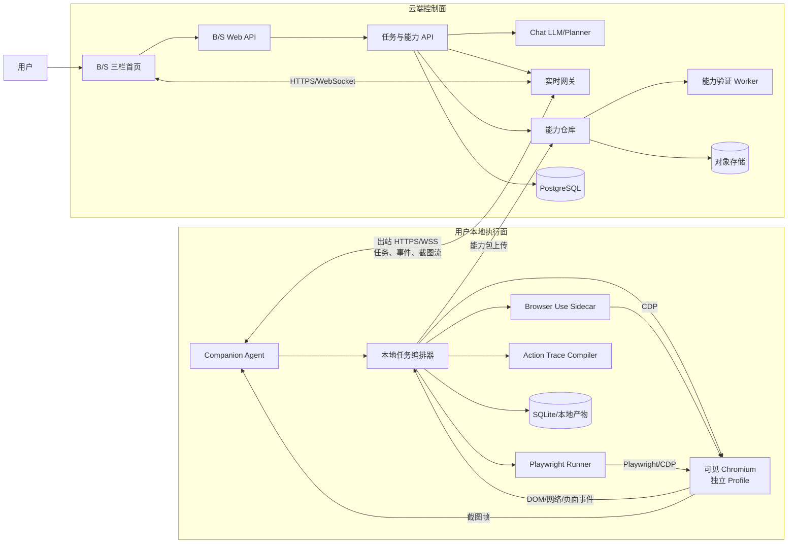
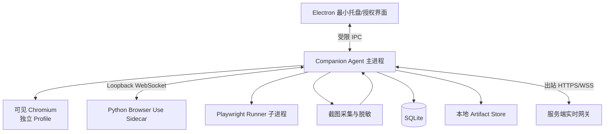
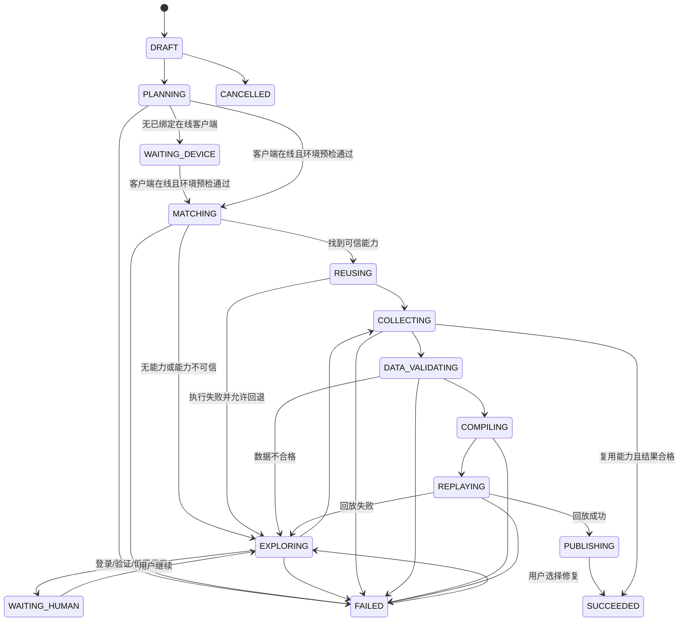
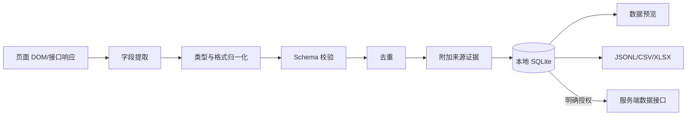
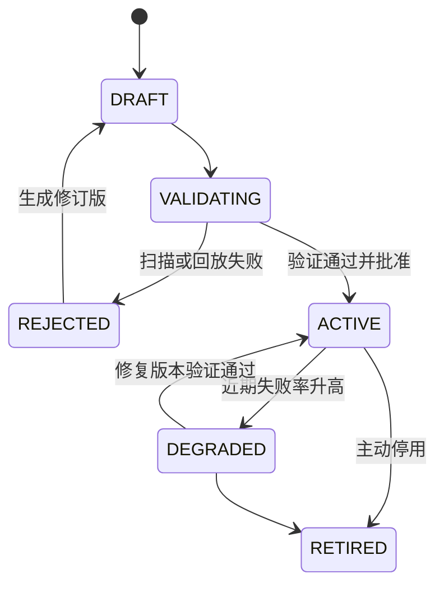
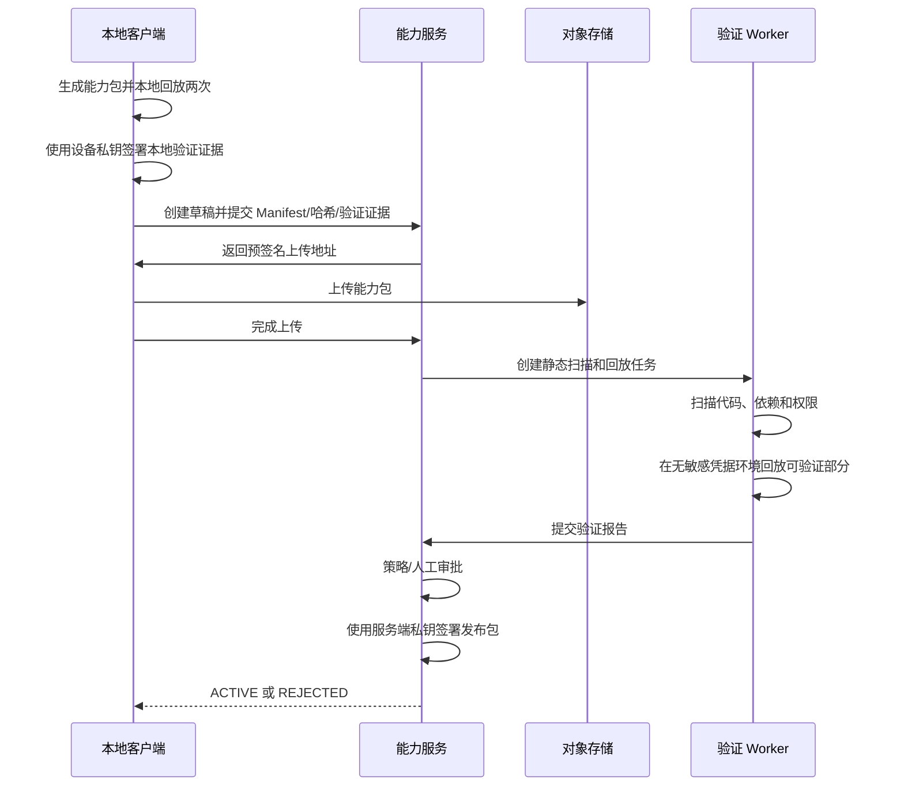

# 智能表单采集与填报通用系统详细设计

> 文档版本：V1.1  
> 状态：MVP 设计基线  
> 更新日期：2026-07-23  
> MVP 范围：网站数据采集  
> 后续范围：智能表单填报

## 1. 文档结论

当前需求已经具备进入技术验证和 MVP 实施的条件，没有阻塞设计的不确定项。

已确定的核心方案如下：

1. 系统采用“云端大脑 + 本地执行 + 服务端能力仓库”的总体架构。
2. B/S 系统首页是统一产品入口，采用三栏界面：左侧 Chat、中间只读任务工作区、右侧执行过程。
3. 本地客户端是执行采集任务的必选 Companion Agent，不采用浏览器插件，也不承载主要业务界面。
4. 中间工作区通过 WebSocket 展示本地受控浏览器的单向实时截图流，不支持 Web 端鼠标、键盘或远程桌面操作。
5. Browser Use 负责未知站点的首次探索、失败诊断和路径修复。
6. Playwright 负责成功路径的确定化、独立回放和后续稳定复用。
7. 登录、验证码、MFA 和人工接管都在客户端拉起的本地原生浏览器窗口中完成。
8. Cookie、密码、验证码、完整浏览器存储默认不上传服务端。
9. 采集成功后必须生成并独立回放验证 Playwright 脚本，验证通过后才能发布到服务端。
10. 服务端沉淀的逻辑单元是“以 Playwright 脚本为核心的能力包”，而不是无法检索和验证的孤立脚本。
11. 首个 MVP 只实现采集闭环，不实现自动填报、自动提交、Web 远程浏览器操作或用户设备性能调度。
12. 同一个浏览器 Profile 同时只允许一个任务控制，人工接管期间自动化必须完全暂停。

仍需通过试点数据调整的内容包括服务端规模、能力复用阈值、数据保留期和目标站点范围。这些属于配置项，不影响当前架构。MVP 不根据用户电脑性能进行任务调度或降级。

## 2. 背景与目标

### 2.1 背景

传统网页采集系统通常存在两个极端：

- 完全依靠人工编写 Playwright/Selenium 脚本，稳定但接入成本高。
- 完全依靠 LLM 浏览器 Agent 实时探索，通用但成本、速度和确定性不足。

本系统将两者组合：

- 用 Browser Use 解决“第一次如何找到路径”。
- 用 Playwright 解决“找到之后如何稳定重复执行”。
- 用本地客户端解决“登录态、验证码、用户信任和浏览器权限”。
- 用 B/S 三栏首页解决“用户如何统一发起、观察和管理任务”。
- 用服务端能力仓库解决“成功经验如何跨任务复用和持续演进”。

### 2.2 产品目标

用户只需要在 Chat 中描述：

- 目标站点。
- 目标模块。
- 需要采集的数据字段。
- 采集范围和筛选条件。

系统应完成：

1. 理解用户意图并形成结构化采集任务。
2. 在本地浏览器中探索并进入目标模块。
3. 必要时提示用户完成登录、验证码或人工纠错。
4. 实时展示浏览器页面、执行步骤和关键日志。
5. 采集并校验结构化数据。
6. 将成功轨迹编译为 Playwright 脚本。
7. 独立回放脚本并验证结果。
8. 将验证通过的能力包上传服务端。
9. 后续同类任务优先复用能力包，失败时再回退到 Browser Use。

### 2.3 非目标

MVP 不包含以下内容：

- 绕过验证码、MFA 或网站安全机制。
- 绕过站点访问控制、付费墙或反爬限制。
- 无用户授权地采集第三方个人信息。
- 自动执行表单最终提交、付款、删除等高风险写操作。
- 支持 Firefox、WebKit 或移动 App。
- 支持跨机器远程实时操控本地浏览器。
- 在 B/S 工作区注入鼠标、键盘、输入法或文件选择事件。
- 根据用户电脑 CPU、内存或 GPU 性能调度和降级任务。
- 构建复杂的分布式微服务体系。
- 对所有网站承诺一次探索即可生成永久稳定脚本。

## 3. 默认假设与待验证项

### 3.1 MVP 默认假设

| 项目 | MVP 默认值 | 说明 |
|---|---|---|
| 首发操作系统 | Windows 10/11 x64 | 后续扩展 macOS |
| Web 前端 | React + TypeScript | 承载 Chat、只读工作区、执行过程和结果管理 |
| 客户端技术 | Electron 最小壳 + Node.js/TypeScript | 托盘、设备绑定、授权、本地编排和自动升级 |
| 浏览器内核 | Playwright 管理的可见 Chromium | 独立 Profile，人工介入时直接切到原生窗口 |
| 智能探索 | Python Browser Use Sidecar | 与桌面主进程隔离 |
| 稳定执行 | Playwright TypeScript | 与客户端执行主技术栈一致 |
| 本地数据库 | SQLite | 保存任务、事件、检查点和采集结果 |
| 服务端 | NestJS 模块化单体 | MVP 降低部署和运维复杂度 |
| 服务端数据库 | PostgreSQL | 保存任务元数据、能力版本和审计记录 |
| 对象存储 | S3 兼容存储 | 保存能力包、证据和可选产物 |
| 服务端协议 | REST/OpenAPI + WebSocket | 资源操作与实时消息分离 |
| 本地进程协议 | Loopback WebSocket | TypeScript/Python 双向事件通信 |
| 身份认证 | OAuth 2.0/OIDC + 短期访问令牌 | 企业环境可接入现有身份平台 |
| 采集数据去向 | 本地优先 | 用户明确授权后才上传服务端 |
| 多租户 | 共享库表 + tenant_id | PostgreSQL RLS 作为纵深防御 |
| 能力发布 | 独立回放通过后人工或策略批准 | MVP 默认要求用户确认发布 |

### 3.2 必须先做的技术验证

以下验证不改变架构，但应在正式开发前用 3 至 5 天完成：

1. 验证 Browser Use 通过 CDP 连接 Playwright 管理的可见 Chromium。
2. 验证 Agent 能稳定锁定任务专属 Browser Context 和 Page，不误操作其他页面。
3. 验证 Browser Use 与 Playwright 在同一任务浏览器上的控制权切换和 API 覆盖范围。
4. 验证人工接管与 Agent 控制权切换期间不会发生并发输入。
5. 验证截图流在页面滚动、弹窗、新标签页、浏览器缩放和断网重连下的表现。
6. 验证成功轨迹能否完整映射为可独立运行的 Playwright Action Trace。
7. 验证 Web 端点击“打开本地浏览器”后，客户端能够安全切前台并建立人工控制锁。

截图流的 MVP 基线方案为：

- Browser Use 使用独立的可见 Chromium 窗口完成探索。
- 客户端以每秒 2 至 5 帧采集受控标签页画面，通过安全 WebSocket 上行。
- B/S 中间工作区只展示画面、URL、标题、控制者和关键标记。
- 人工接管时由客户端将 Chromium 原生窗口切到前台。
- Playwright 脚本和能力仓库设计保持不变。

MVP 不引入 WebRTC。只有在截图流延迟或带宽无法满足只读观察需求时，才评估将画面通道升级为 WebRTC；升级后仍不开放 Web 端远程输入。

### 3.3 投产前确认项

以下内容不阻塞 MVP 开发，但在真实业务试点前必须由产品、业务和安全负责人确认：

| 确认项 | 当前默认方案 | 最晚确认点 |
|---|---|---|
| 首批目标站点 | 选择 3 至 5 个已获得授权的内部或合作站点 | 阶段 1 开始前 |
| 数据最终去向 | 本地保存和导出，不自动上传 | 真实站点试点前 |
| 数据保留期 | 采集数据由用户主动删除；实时画面帧不落盘，证据截图默认保留 7 天 | 真实站点试点前 |
| 身份提供方 | 标准 OIDC，开发环境使用内置测试 IdP | 阶段 3 开始前 |
| 能力发布审批人 | 任务发起人确认，本地验证与服务端扫描均通过 | 阶段 3 开始前 |
| 请求频率 | 单站点默认 1 个并发、操作间隔不低于 500 ms | 每个站点接入时 |
| 用户与任务规模 | 试点不超过 100 用户、20 个同时在线任务 | 服务端压测前 |
| 采集数据合规等级 | 默认按敏感业务数据处理 | 每个数据源接入时 |

## 4. 核心设计原则

### 4.1 本地优先

- 浏览器运行在本地。
- 登录和验证在本地。
- Cookie、LocalStorage、SessionStorage 和密码留在本地。
- 采集结果默认保存在本地。
- 上传行为必须经过策略判断和用户授权。

### 4.2 探索与执行分离

- Browser Use 可以动态判断、尝试和修正。
- Playwright 脚本必须确定、可测试、可审计。
- 不把 Agent 的自然语言推理直接当成可复用能力。

### 4.3 控制面与执行面分离

- 云端 Chat LLM 负责意图理解、任务规划和异常解释。
- B/S 前端负责对话、只读实时观察、任务控制和结果管理。
- 本地执行器负责访问页面、输入、点击、提取和文件处理。
- 云端不能直接访问本地浏览器 CDP 端口。

### 4.4 人工随时可见、可停、可接管

- 用户能够在 B/S 工作区看到 Agent 当前所在页面的实时截图。
- 用户能够看到当前步骤和下一步计划。
- 用户可以在 B/S 页面暂停、继续或终止；需要接管时在本地原生浏览器中操作。
- 高风险行为默认要求确认。

### 4.5 能力必须经过验证才能复用

- 一次采集结果正确，不代表脚本可复用。
- 能力必须通过独立新运行上下文回放。
- 必须校验字段、数量、数据类型、重复率和关键样本。
- 能力版本不可覆盖，只能新增版本并支持回滚。

### 4.6 生成代码按不可信代码处理

- 从服务端下载的能力包必须签名和校验哈希。
- Playwright 脚本运行在受限执行进程中。
- 禁止脚本任意启动进程、访问非授权文件和访问非授权域名。
- 发布前执行静态扫描和动态回放。

## 5. 总体架构



### 5.1 架构职责

| 组件 | 主要职责 | 明确不负责 |
|---|---|---|
| Chat LLM | 意图理解、任务规划、异常说明、结果总结 | 直接持有浏览器和登录态 |
| B/S 三栏首页 | Chat、只读实时画面、步骤日志、控制命令、结果预览 | 向本地浏览器注入鼠标键盘事件 |
| 本地编排器 | 状态机、权限、事件、控制权、组件协调 | 自己推理网页路径 |
| Browser Use | 未知路径探索、页面理解、失败修复 | 作为永久生产脚本 |
| Playwright Runner | 已验证能力执行、回放、断言、追踪 | 未知站点自主推理 |
| Action Trace Compiler | 将语义轨迹转换为 Playwright 代码 | 决定用户业务意图 |
| 可见 Chromium | 承载任务页面、独立登录态和本地人工操作 | 暴露公网 CDP 或承载 B/S 主界面 |
| Companion Agent | 设备连接、任务执行、截图流、本地接管和产物管理 | 提供完整 Chat 或任务管理 UI |
| 能力仓库 | 检索、版本、签名、发布、回滚 | 保存用户浏览器凭证 |
| 验证 Worker | 静态扫描和无敏感登录态回放 | 使用用户本地 Cookie |

## 6. B/S 前端与客户端详细设计

### 6.1 客户端进程模型



#### 最小本地界面

负责：

- 托盘状态和客户端版本。
- 设备绑定、解除绑定和权限授权。
- 当前任务摘要和“打开浏览器”入口。
- 人工接管完成后的“继续执行”操作。

限制：

- `nodeIntegration=false`。
- `contextIsolation=true`。
- 不直接访问文件系统、CDP 或操作系统凭据。
- 只能通过白名单 IPC 调用主进程能力。
- 不承载 Chat、三栏工作区、完整日志和结果管理。

#### Companion Agent 主进程

负责：

- 启动和管理任务专属可见 Chromium。
- 维护独立、持久化的浏览器 Profile。
- 管理 Browser Use Sidecar 和 Playwright Runner。
- 维护任务状态机和控制权锁。
- 写入 SQLite、产物目录和审计日志。
- 主动与服务端建立 HTTPS/WSS 连接，不监听公网端口。
- 采集、脱敏和上传受控浏览器截图帧。
- 人工接管时将本地 Chromium 窗口切到前台。

#### Browser Use Sidecar

负责：

- 根据结构化目标探索目标站点。
- 使用 Browser Use Lifecycle Hooks 输出动作和状态。
- 将每个动作转换为统一语义事件。
- 在不确定、失败或敏感操作前请求编排器决策。

Sidecar 不负责：

- 直接上传数据到服务端。
- 读取客户端 Token、Cookie 文件或任意本地文件。
- 绕过本地编排器执行高风险操作。

#### Playwright Runner

负责：

- 执行已签名能力包。
- 运行新生成脚本的独立回放。
- 输出 Playwright Trace、截图、断言和结构化结果。
- 按检查点恢复分页采集任务。

Runner 作为独立子进程运行，崩溃或脚本超时不能导致 Companion Agent 主进程退出。

### 6.2 B/S 首页三栏 UI

```text
┌─────────────────────────────────────────────────────────────────────────┐
│ 任务名 | 目标设备 | 站点 | 模式：探索/复用 | 状态 | 暂停 | 接管 | 继续 | 终止 │
├──────────────────┬──────────────────────────────┬───────────────────────┤
│ Chat             │ 只读任务工作区               │ 执行过程              │
│                  │                              │                       │
│ 需求输入         │ 本地浏览器实时截图           │ 任务计划              │
│ 任务范围确认     │ URL/标题/当前元素标记        │ 当前步骤              │
│ 人工纠错         │ Agent/Human 控制状态          │ 关键动作              │
│ 结果摘要         │ 打开本地浏览器按钮           │ 决策与异常            │
│ 导出与发布确认   │ 数据定位和采集提示           │ 调试日志              │
├──────────────────┴──────────────────────────────┴───────────────────────┤
│ 已采集 137 条 | 当前第 3 页 | 失败 2 条 | 本地隐私模式 | 运行 02:18     │
└─────────────────────────────────────────────────────────────────────────┘
```

#### 左侧 Chat

核心功能：

- 接收自然语言目标。
- 展示结构化任务草稿。
- 询问确实影响任务的缺失参数。
- 接收用户对字段、范围和错误结果的修正。
- 展示结果摘要和导出入口。

Chat 不直接发出点击指令。LLM 输出必须先经过 JSON Schema 验证，再由服务端任务编排器形成任务计划，最后下发给指定 Companion Agent。

#### 中间工作区

工作区通过 WebSocket 接收客户端上传的压缩截图帧，展示受控浏览器的单向实时画面。客户端优先使用本地 CDP Screencast 获取帧，无法使用时回退到 Playwright 截图。截图流目标帧率为每秒 2 至 5 帧，根据页面变化自适应；无变化时降低发送频率。

工作区提供：

- 当前 URL、标题、页面尺寸和连接状态。
- 当前控制者状态。
- Agent 当前或即将操作元素的边框和标签。
- 页面加载、下载、弹窗和新标签页提示。
- “打开本地浏览器”、暂停、继续和终止按钮。
- 采集字段的即时标记。
- 登录、验证码和敏感页面时的暂停推流或脱敏提示。

任务创建时必须固定 `deviceId`。B/S 顶部持续显示目标设备名称、在线状态和客户端版本。“打开本地浏览器”命令经服务端 WSS 下发给该设备；如果当前 Web 操作者与目标设备不在同一电脑，界面必须明确提示浏览器将在目标设备上打开。

工作区明确不提供：

- 鼠标、键盘、触摸、输入法和文件选择事件注入。
- Web 远程桌面或跨机器浏览器操作。
- 浏览器 DOM、CDP 地址或登录凭证的直接访问。

#### 右侧执行过程

右侧不是原始日志终端，而是四层信息：

1. 任务计划：用户能理解的阶段列表。
2. 当前步骤：正在执行的语义动作。
3. 关键事件：登录、分页、提取、重试、人工接管。
4. 调试详情：CDP、Selector 和模型调用信息，默认折叠。

### 6.3 浏览器会话

每个工作空间使用独立、持久化的 Chromium User Data Directory：

```text
profiles/{tenantId}/{workspaceId}
```

规则：

- 不直接复用用户日常 Chrome 的默认 Profile。
- 每个租户和工作空间隔离 Cookie 与站点数据。
- 用户可在客户端删除某个工作空间的浏览器数据。
- Cookie 不写入任务事件或服务端日志。
- CDP 仅监听 `127.0.0.1`，使用随机端口。
- Sidecar 启动时通过一次性令牌获得端口信息。
- 任务结束后关闭 CDP 接入或终止 Sidecar。
- 同一 Profile 同时只允许一个任务持有控制锁；该限制用于保证状态一致性，不属于设备性能调度。

### 6.4 控制权模型

控制权状态：

| 状态 | 含义 | 可执行输入 |
|---|---|---|
| `AGENT_CONTROL` | Agent 或 Playwright 正在控制 | 自动化输入 |
| `HUMAN_CONTROL` | 用户接管浏览器 | 人工鼠标键盘 |
| `WAITING_APPROVAL` | 等待用户批准敏感动作 | 仅批准、拒绝、接管 |
| `TRANSFERRING` | 清理在途动作并切换控制权 | 禁止新输入 |

切换到人工控制的步骤：

1. 停止产生新 Agent 动作。
2. 等待当前原子动作完成或超时取消。
3. 清空输入队列。
4. 写入控制权切换事件。
5. 客户端将本地 Chromium 原生窗口切到前台并把页面焦点交给用户。

恢复 Agent 控制的步骤：

1. 用户在本地客户端或 B/S 页面点击“继续执行”。
2. 获取当前 URL、标题、页面指纹和活动 Target。
3. 判断页面是否仍符合任务上下文。
4. 重新规划后续步骤。
5. 切换为 `AGENT_CONTROL`。

### 6.5 人工介入触发条件

强制人工介入：

- 用户名、密码输入。
- 图形验证码、滑块验证码。
- 短信、邮件、TOTP、硬件密钥验证。
- 网站协议或隐私授权确认。
- 发现目标域名之外的跳转。
- 下载可执行文件。
- 脚本试图访问非授权目录。

策略可配置的人工介入：

- Agent 对字段映射置信度低于阈值。
- 采集结果完整率低于阈值。
- 页面指纹与能力包差异较大。
- 连续重试超过上限。
- 即将产生大量请求。

### 6.6 本地存储

本地 SQLite 保存：

- 任务定义。
- 状态机检查点。
- 结构化执行事件。
- Action Trace。
- 采集数据。
- 字段校验结果。
- 能力包草稿和回放结果。

本地产物目录保存：

- 明确作为证据生成的截图；实时画面帧只在内存中短暂存在。
- Playwright Trace。
- 下载文件。
- 导出 CSV/JSON/XLSX。
- 能力包构建目录。

敏感字段使用操作系统凭据库或由操作系统凭据保护的密钥加密。日志和截图按任务设置自动清理。

## 7. 服务端详细设计

### 7.1 服务端形态

MVP 使用 NestJS 模块化单体，不拆分微服务。原因：

- Chat、任务、能力和审计存在较强事务关联。
- MVP 规模不足以证明独立扩缩容的价值。
- TypeScript 可与客户端共享 DTO、事件和能力规范。
- 后续可将验证 Worker 和 LLM Gateway 独立部署。

服务端模块：

```text
server/src/
├── auth/
├── tenants/
├── devices/
├── conversations/
├── tasks/
├── capabilities/
├── validations/
├── artifacts/
├── audit/
├── realtime/
└── shared/
```

### 7.2 服务端组件

| 模块 | 职责 |
|---|---|
| Auth | 用户登录、Token、设备注册、权限 |
| Conversations | Chat 会话、消息和结构化任务草稿 |
| Tasks | 任务元数据、状态摘要、客户端分配 |
| Capabilities | 能力检索、版本、发布、回滚、签名 |
| Validations | 静态扫描、回放任务和验证报告 |
| Artifacts | 对象存储上传凭证、哈希和保留策略 |
| Audit | 用户、设备、能力和敏感操作审计 |
| Realtime | WebSocket 会话、心跳、命令、事件摘要和实时画面内存转发 |
| LLM Gateway | 模型路由、结构化输出、成本和重试 |

### 7.3 服务端不保存的内容

默认禁止上传：

- 用户名和密码。
- Cookie、LocalStorage、SessionStorage。
- MFA Secret 和一次性验证码。
- 完整浏览器 Profile。
- 未脱敏的 Authorization Header。
- 页面中与任务字段无关的个人信息。
- 原始 LLM Secret。

默认只允许上传：

- 结构化任务摘要。
- 脱敏后的关键事件。
- 能力包。
- 回放验证结果。
- 页面指纹。
- 经过脱敏的实时截图帧，仅用于当前会话内存转发，默认不落盘。
- 用户明确选择上传的采集数据。

## 8. 任务与执行状态机

### 8.1 主状态



所有运行中状态都允许进入：

- `PAUSED`
- `CANCELLED`
- `WAITING_HUMAN`

`WAITING_DEVICE` 不是云端回退信号。本地客户端是执行任务的必选依赖，设备离线时任务保持等待或由用户取消，服务端不得改为云端浏览器执行。

### 8.2 状态持久化

每次状态转换必须在同一 SQLite 事务中完成：

1. 校验旧状态和新状态转换合法。
2. 更新任务状态和版本号。
3. 写入状态转换事件。
4. 写入最新检查点。

恢复时依据：

- 当前状态。
- 最后成功步骤。
- 当前 URL 和页面指纹。
- 分页游标。
- 已落盘记录数。
- 控制权状态。

不可安全恢复时，任务进入 `WAITING_HUMAN`，不自动重放可能有副作用的动作。

## 9. 意图理解与任务规划

### 9.1 结构化任务定义

```json
{
  "taskType": "collect",
  "site": {
    "entryUrl": "https://example.com",
    "allowedDomains": ["example.com"],
    "moduleHint": "客户订单"
  },
  "target": {
    "entity": "order",
    "fields": [
      {
        "name": "orderNo",
        "label": "订单号",
        "type": "string",
        "required": true
      },
      {
        "name": "amount",
        "label": "金额",
        "type": "decimal",
        "required": true
      }
    ]
  },
  "scope": {
    "dateRange": {
      "mode": "relative",
      "value": "P30D"
    },
    "maxRecords": 10000
  },
  "pagination": {
    "mode": "auto",
    "maxPages": 500
  },
  "output": {
    "format": "jsonl",
    "destination": "local"
  }
}
```

### 9.2 LLM 输出约束

- 使用版本化 JSON Schema。
- 服务端对输出执行严格校验。
- 不接受模型生成的任意 JavaScript 直接运行。
- 规划结果只能使用系统注册的语义动作。
- 业务字段和页面选择器分离。
- 用户修改任务后产生新 revision，运行中的任务使用固定 revision。

### 9.3 语义动作集合

MVP 支持：

- `navigate`
- `switch_tab`
- `click`
- `fill`
- `select`
- `wait_for`
- `set_filter`
- `extract_list`
- `extract_detail`
- `paginate`
- `download`
- `assert`
- `request_human`

不在集合中的动作必须被本地策略引擎拒绝或要求批准。

## 10. Browser Use 探索设计

### 10.1 探索输入

Browser Use 接收：

- 当前任务定义。
- 允许访问的域名。
- 当前页面和页面指纹。
- 当前控制权。
- 已完成步骤。
- 数据字段 Schema。
- 最大步骤数、最大重试数和时间预算。

### 10.2 探索输出

每一步输出：

- 模型选择的语义动作。
- 操作前页面状态。
- 元素候选和定位依据。
- 操作结果。
- 操作后 URL 和页面指纹。
- 提取的数据。
- 置信度。
- 是否需要人工介入。

Browser Use 官方能力支持通过 CDP 连接已有浏览器，并可通过 Lifecycle Hooks 读取 Agent 动作、URL、提取内容和当前 Target。系统利用这些 Hook 建立 Action Trace，而不是解析自然语言日志。

### 10.3 预算和限制

MVP 默认：

| 参数 | 默认值 |
|---|---:|
| 单任务最大 Agent 步骤 | 100 |
| 单步骤超时 | 30 秒 |
| 同动作最大重试 | 2 |
| 连续失败后人工介入 | 3 次 |
| 页面稳定等待 | 最长 15 秒 |
| 单任务 Agent 总时长 | 30 分钟 |
| 默认最大采集记录 | 10,000 |

超过预算后进入 `WAITING_HUMAN`，不继续消耗模型资源。

## 11. Action Trace 与 Playwright 脚本生成

### 11.1 为什么需要 Action Trace

Browser Use 的 Agent History 适合观察，但不能直接等价为稳定脚本。系统需要建立中间表示，使探索过程和 Playwright 代码解耦。

Action Trace 是一组经过标准化的语义步骤：

```json
{
  "traceVersion": "1.0",
  "stepId": "step-017",
  "action": "click",
  "page": {
    "urlPattern": "https://example.com/orders*",
    "fingerprint": "sha256:..."
  },
  "target": {
    "preferred": {
      "strategy": "role",
      "role": "button",
      "name": "查询"
    },
    "fallbacks": [
      {
        "strategy": "label",
        "value": "查询"
      },
      {
        "strategy": "css",
        "value": "[data-testid='search']"
      }
    ]
  },
  "preconditions": [
    {
      "type": "visible",
      "target": "preferred"
    }
  ],
  "postconditions": [
    {
      "type": "network_idle"
    },
    {
      "type": "visible",
      "selector": "table"
    }
  ],
  "evidence": {
    "screenshot": "artifacts/step-017.webp"
  }
}
```

### 11.2 Trace 记录来源

- Browser Use 模型动作。
- Browser Use Tool 调用。
- CDP 页面、网络和 Target 事件。
- 用户人工操作中的关键语义事件。
- 用户对字段映射的修正。
- 数据提取和校验结果。

人工操作不会逐字记录密码或验证码。密码字段只记录：

```json
{
  "action": "human_secret_input",
  "field": "password",
  "valueRecorded": false
}
```

### 11.3 Trace 规范化

编译前执行：

1. 删除无业务意义的鼠标移动和重复等待。
2. 合并连续输入。
3. 将像素点击替换为语义 Locator。
4. 补充操作前置和后置断言。
5. 将固定日期替换为任务参数。
6. 将分页过程转换为循环。
7. 将列表字段映射转换为 Schema 驱动提取。
8. 对敏感输入插入 `request_human` 占位步骤。
9. 对新标签页和下载建立显式等待。
10. 对所有循环设置上限和终止条件。

### 11.4 Locator 优先级

从高到低：

1. `getByRole` + 可访问名称。
2. `getByLabel`。
3. 稳定的 `data-testid` 或业务属性。
4. 文本与局部容器组合。
5. 稳定 CSS 属性组合。
6. XPath。
7. 坐标定位，仅允许作为探索证据，不允许进入发布能力。

### 11.5 生成脚本接口

能力脚本不负责启动浏览器，只接收运行时提供的 `Page` 和任务参数：

```typescript
export interface CollectorContext<TParams> {
  page: Page;
  params: TParams;
  checkpoint: CheckpointStore;
  emit: (event: RuntimeEvent) => Promise<void>;
  output: RecordWriter;
  requestHuman: (reason: HumanReason) => Promise<void>;
}

export async function run(
  context: CollectorContext<CollectorParams>,
): Promise<CollectorResult> {
  // Generated deterministic Playwright workflow.
}
```

这样同一脚本可以运行于：

- Companion Agent 管理的本地可见 Chromium。
- 服务端验证环境的无头 Chromium。

### 11.6 Playwright CDP 限制

Playwright 官方说明 `connectOverCDP` 仅支持 Chromium，且保真度低于 Playwright 原生协议连接。因此：

- MVP 浏览器内核固定为 Chromium。
- 能力脚本只使用已通过兼容性测试的 Playwright API 子集。
- 复杂下载、弹窗、权限和多 Context 场景列入专项测试。
- 服务端验证优先使用 Playwright 原生启动的 Chromium。
- CDP 不兼容的能力标记为 `local-only`，不得宣称可在服务端无头验证。

## 12. 数据采集设计

### 12.1 数据管道



### 12.2 记录格式

每条数据包含业务字段和来源信息：

```json
{
  "recordId": "01J...",
  "data": {
    "orderNo": "SO-20260723-001",
    "amount": "1280.00",
    "status": "已完成"
  },
  "provenance": {
    "sourceUrl": "https://example.com/orders/123",
    "capturedAt": "2026-07-23T10:30:20+08:00",
    "pageNumber": 3,
    "sourceFingerprint": "sha256:...",
    "capabilityVersion": null
  },
  "validation": {
    "valid": true,
    "warnings": []
  }
}
```

### 12.3 数据校验

至少执行：

- 必填字段完整率。
- 类型校验。
- 日期和金额格式归一化。
- 枚举值检查。
- 主键或业务键重复检查。
- 页数和记录数合理性检查。
- 抽样与页面证据比对。
- 采集前后页重复率检查。

MVP 默认发布门槛：

| 指标 | 门槛 |
|---|---:|
| 必填字段完整率 | 100% |
| Schema 有效率 | 不低于 99% |
| 业务键重复率 | 不高于 0.5% |
| 独立回放成功率 | 2 次连续成功 |
| 抽样证据一致率 | 100% |

门槛可按站点和模块覆盖，但降低门槛必须记录审批原因。

### 12.4 大数据量处理

- 使用流式提取，不把全部记录保存在内存。
- 每 100 条或每页提交一个 SQLite 事务。
- 使用 JSONL 作为内部大数据交换格式。
- 每页保存检查点。
- 导出 XLSX 时分页或分 Sheet。
- 默认 10,000 条上限，用户确认后可提高。

## 13. 能力包设计

### 13.1 能力包结构

```text
capability/
├── manifest.json
├── src/
│   └── collector.ts
├── schema/
│   ├── parameters.schema.json
│   └── output.schema.json
├── fingerprints/
│   └── site-fingerprint.json
├── tests/
│   └── collector.spec.ts
├── fixtures/
│   └── expected-sample.json
├── evidence/
│   └── validation-summary.json
├── checksums.json
└── signature.json
```

`collector.ts` 是核心沉淀物。其他文件用于判断它是什么、何时可用、是否可信以及如何回滚。

能力包不得携带自定义依赖或安装脚本。它只能调用平台提供并固定版本的 `capability-sdk` 和 Playwright API 子集。

### 13.2 Manifest

```json
{
  "schemaVersion": "1.0",
  "capabilityId": "cap_example_orders",
  "version": "1.0.0",
  "tenantId": "tenant_001",
  "name": "示例站点订单采集",
  "taskType": "collect",
  "site": {
    "domains": ["example.com"],
    "entryUrlPatterns": ["https://example.com/orders*"],
    "module": "orders"
  },
  "runtime": {
    "language": "typescript",
    "playwrightRange": "pinned-by-platform",
    "browser": "chromium",
    "mode": ["cdp", "native-playwright"]
  },
  "permissions": {
    "domains": ["example.com"],
    "downloads": false,
    "uploads": false,
    "filesystem": ["task-output"],
    "requiresHumanLogin": true
  },
  "validation": {
    "status": "passed",
    "validatedAt": "2026-07-23T10:40:00Z",
    "consecutivePasses": 2,
    "successRate30d": null
  },
  "fingerprints": [
    "sha256:..."
  ],
  "entrypoint": "src/collector.ts"
}
```

### 13.3 能力状态



规则：

- 已发布版本不可修改。
- 修复必须创建新版本。
- `ACTIVE` 才能自动匹配。
- `DEGRADED` 只能在用户确认后运行。
- `RETIRED` 不能用于新任务。
- 回滚是切换当前活动版本，不删除历史版本。

### 13.4 能力检索

检索条件：

- Tenant。
- 任务类型。
- 域名。
- URL Pattern。
- 模块。
- 输出字段集合。
- 页面指纹。
- 浏览器和运行时兼容性。
- 最近成功率和验证时间。

建议评分：

```text
score =
  0.30 * domainMatch +
  0.20 * moduleMatch +
  0.20 * fieldCoverage +
  0.15 * fingerprintSimilarity +
  0.10 * recentSuccessRate +
  0.05 * freshness
```

默认路由：

- `score >= 0.85`：自动复用。
- `0.65 <= score < 0.85`：展示能力信息，用户确认后复用。
- `score < 0.65`：使用 Browser Use 探索。

执行前进行轻量探测：

1. 打开入口页。
2. 比较 URL 和页面指纹。
3. 检查关键 Locator。
4. 检查权限和登录状态。
5. 通过后才运行完整能力。

### 13.5 发布流程



对于需要登录的能力，“独立回放”指在新的 Page 和清空的任务检查点中运行，但允许继续使用同一本地 Session Partition 中的已登录状态。服务端验证 Worker 不持有用户登录态，因此只执行静态扫描、无登录可达路径回放和证据校验，不能用服务端回放替代本地两次完整验证。

## 14. 实时事件设计

### 14.1 事件包络

```json
{
  "eventId": "01J...",
  "taskId": "task_001",
  "sequence": 127,
  "timestamp": "2026-07-23T10:30:20.123+08:00",
  "source": "browser-use",
  "type": "action.started",
  "severity": "info",
  "payload": {
    "stepId": "step-017",
    "action": "click",
    "message": "点击下一页"
  },
  "privacy": {
    "containsSensitiveData": false,
    "uploadAllowed": true
  }
}
```

### 14.2 事件类型

| 分类 | 示例 |
|---|---|
| 任务 | `task.created`、`task.state_changed`、`task.completed` |
| 计划 | `plan.created`、`plan.revised` |
| 浏览器 | `browser.navigated`、`browser.popup`、`browser.download`、`browser.stream_state_changed` |
| 动作 | `action.proposed`、`action.started`、`action.succeeded`、`action.failed` |
| 控制权 | `control.requested`、`control.transferred` |
| 人工介入 | `human.required`、`human.resumed` |
| 数据 | `record.extracted`、`batch.persisted`、`data.validation_failed` |
| 能力 | `capability.compiled`、`capability.replay_passed`、`capability.published` |
| 安全 | `policy.blocked`、`domain.blocked`、`secret.redacted` |

### 14.3 可靠性

- 任务内 `sequence` 单调递增。
- 本地事件先写 SQLite，再推送服务端。
- B/S 页面断开后按 sequence 补拉持久化事件。
- 服务端只接收允许上传的事件。
- 重复事件按 `eventId` 幂等处理。
- WebSocket 心跳 30 秒，断线指数退避重连。
- 实时画面帧是可丢弃的瞬时数据，不进入任务事件序列，不补传、不落盘。

## 15. API 设计

### 15.1 协议选择

| 场景 | 协议 |
|---|---|
| 登录、任务、能力、Artifact | REST + OpenAPI 3.1 |
| Chat 流、任务命令、状态摘要 | WebSocket |
| 浏览器只读实时画面 | WebSocket 二进制帧，服务端仅内存转发 |
| 大文件上传 | 对象存储预签名 URL |
| 本地 TypeScript/Python 通信 | Loopback WebSocket JSON |

REST 统一使用：

- `/v1` 路径版本。
- JSON camelCase。
- UUID/ULID 公共 ID。
- RFC 9457 错误格式。
- `X-Request-Id`。
- Cursor Pagination。

### 15.2 核心 REST API

| 方法 | 路径 | 用途 |
|---|---|---|
| `POST` | `/v1/device-registrations` | 注册本地客户端 |
| `GET` | `/v1/devices/{deviceId}` | 获取设备状态 |
| `POST` | `/v1/conversations` | 创建 Chat 会话 |
| `GET` | `/v1/conversations/{id}/messages` | 获取消息 |
| `POST` | `/v1/tasks` | 创建任务元数据 |
| `GET` | `/v1/tasks/{taskId}` | 查询任务摘要 |
| `PATCH` | `/v1/tasks/{taskId}` | 更新可变任务元数据 |
| `POST` | `/v1/tasks/{taskId}/commands` | 暂停、继续、取消 |
| `GET` | `/v1/capabilities` | 检索能力 |
| `POST` | `/v1/capabilities` | 创建能力草稿 |
| `POST` | `/v1/capabilities/{id}/versions` | 创建不可变版本 |
| `POST` | `/v1/capability-versions/{id}/uploads` | 获取上传地址 |
| `POST` | `/v1/capability-versions/{id}/validate` | 请求验证 |
| `POST` | `/v1/capability-versions/{id}/publish` | 发布 |
| `POST` | `/v1/capabilities/{id}/rollback` | 回滚活动版本 |
| `POST` | `/v1/artifacts/uploads` | 获取 Artifact 上传地址 |

### 15.3 WebSocket 消息

连接：

```text
wss://api.example.com/v1/realtime
```

客户端消息：

- `client.hello`
- `client.heartbeat`
- `task.event_summary`
- `task.command_ack`
- `browser.frame`
- `browser.stream_state`
- `capability.upload_progress`

服务端消息：

- `chat.delta`
- `chat.completed`
- `task.plan`
- `task.command`
- `browser.stream_policy`
- `capability.match`
- `policy.updated`
- `session.expiring`

所有消息包含：

- `messageId`
- `type`
- `timestamp`
- `correlationId`
- `payload`

`browser.frame` 使用独立的二进制消息格式，至少包含 `taskId`、`frameSequence`、`capturedAt`、`width`、`height`、`mimeType` 和脱敏标记。服务端只向当前任务的授权观察者转发；观察者断开时客户端应降频或暂停发送。

## 16. 数据模型

### 16.1 服务端核心表

| 表 | 关键字段 | 说明 |
|---|---|---|
| `tenants` | `id`, `name`, `status` | 租户 |
| `users` | `id`, `tenant_id`, `external_subject`, `role` | 用户 |
| `devices` | `id`, `tenant_id`, `user_id`, `public_key`, `status` | 本地客户端 |
| `conversations` | `id`, `tenant_id`, `user_id`, `title` | Chat 会话 |
| `messages` | `id`, `conversation_id`, `role`, `content_redacted` | 脱敏消息 |
| `tasks` | `id`, `tenant_id`, `user_id`, `device_id`, `state`, `definition` | 任务元数据 |
| `task_summaries` | `task_id`, `progress`, `result_summary` | 服务端任务摘要 |
| `capabilities` | `id`, `tenant_id`, `site_key`, `module_key`, `active_version_id` | 能力逻辑实体 |
| `capability_versions` | `id`, `capability_id`, `version`, `manifest`, `artifact_key`, `status` | 不可变版本 |
| `site_fingerprints` | `id`, `capability_version_id`, `fingerprint`, `features` | 页面指纹 |
| `validation_runs` | `id`, `capability_version_id`, `status`, `report` | 验证记录 |
| `capability_executions` | `id`, `capability_version_id`, `result`, `duration_ms` | 运行质量统计 |
| `audit_logs` | `id`, `tenant_id`, `actor_id`, `action`, `resource`, `metadata` | 审计记录 |

### 16.2 本地核心表

| 表 | 关键字段 | 说明 |
|---|---|---|
| `local_tasks` | `id`, `definition`, `state`, `revision`, `checkpoint` | 本地任务真相 |
| `task_events` | `event_id`, `task_id`, `sequence`, `type`, `payload` | 完整事件 |
| `action_traces` | `task_id`, `step_id`, `action`, `trace` | 语义轨迹 |
| `datasets` | `id`, `task_id`, `schema`, `record_count` | 采集数据集 |
| `dataset_records` | `id`, `dataset_id`, `business_key`, `data`, `provenance` | 数据记录 |
| `artifacts` | `id`, `task_id`, `type`, `path`, `hash`, `expires_at` | 本地产物 |
| `capability_drafts` | `id`, `task_id`, `manifest`, `local_path`, `status` | 能力草稿 |
| `sync_outbox` | `id`, `type`, `payload`, `status`, `retry_at` | 可靠同步 Outbox |

### 16.3 多租户

- 所有服务端业务表带 `tenant_id`。
- 复合索引以 `tenant_id` 为首列。
- Repository 必须显式接收 `tenantId`。
- PostgreSQL RLS 作为第二道隔离。
- 能力默认租户私有。
- 跨租户共享能力需要单独的审核、脱敏和许可模型，MVP 不实现。

## 17. 安全设计

### 17.1 威胁边界

需要重点防范：

- 恶意网站通过受控 Chromium、CDP 或本地协议访问客户端能力。
- Prompt Injection 诱导 Agent 离开任务范围。
- 生成脚本执行任意 Node.js、系统命令或文件操作。
- 服务端能力包被篡改。
- CDP 端口被局域网或其他进程访问。
- 日志、截图和 LLM 请求泄露敏感数据。
- 能力被错误地跨租户复用。

### 17.2 客户端与浏览器隔离

- Electron 只承载最小托盘和授权界面，不加载目标站点。
- `nodeIntegration=false`。
- `contextIsolation=true`。
- Renderer Sandbox 开启。
- IPC 使用明确 Channel Allowlist 和参数 Schema。
- 目标站点只运行在 Playwright 管理的独立 Chromium Profile 中。
- Chromium 权限请求按 Origin 白名单处理。
- 禁止目标站点导航到 `file://`、`javascript:` 和客户端内部协议。
- 目标站点不能访问 Electron IPC、客户端 Token 和本地任务数据库。

### 17.3 CDP 安全

- 只绑定 `127.0.0.1`。
- 随任务创建并销毁。
- 使用随机端口和一次性本地握手令牌。
- 不向服务端发送 CDP 地址。
- Sidecar 只获得任务专属 Browser Context 和 Page 的 Target 信息。
- 记录 Target 切换事件。
- PoC 必须验证 Agent 不可访问 Companion Agent 本地界面及其他 Profile。

### 17.4 能力脚本安全

静态扫描禁止：

- `child_process`。
- `process.exec` 类行为。
- 任意动态 `eval`、`Function` 和动态远程模块。
- 未声明的文件系统路径。
- 未声明的网络域名。
- 读取环境变量全集。
- 自定义原生二进制依赖。

运行时限制：

- 单独子进程。
- 最小环境变量。
- 文件系统只读能力包，读写任务目录。
- 网络仅允许 Manifest 中的 Domain。
- CPU、内存、运行时间和输出大小限制。
- 父进程可随时终止。

发布安全：

- 能力包生成 SHA-256 哈希。
- 服务端使用私钥签名。
- 客户端执行前验证签名、哈希、Tenant 和权限。
- 依赖必须锁版本并通过供应链扫描。

### 17.5 Prompt Injection 防护

网页内容属于不可信数据，不能修改系统策略。具体措施：

- 系统策略和任务目标不拼接为可被网页覆盖的同级文本。
- Agent 只能调用白名单语义工具。
- 工具层再次校验 Domain、动作和数据范围。
- 网页提出“上传文件”“发送 Cookie”“忽略指令”等要求时必须阻断。
- 从网页抽取的数据不直接作为工具参数执行。
- 高风险动作需要用户批准。

### 17.6 隐私与合规

- 任务启动前要求用户确认其对站点和数据具有访问、采集权限。
- 尊重站点服务条款、适用法律和企业数据政策。
- 设置请求频率和并发上限。
- 提供数据导出、删除和保留期配置。
- 实时画面帧默认只做内存转发，不写数据库、日志或对象存储。
- 登录、验证码和敏感页面按策略暂停推流或先做区域脱敏。
- 失败证据截图与实时画面帧分离管理，证据截图默认短期保存。
- LLM 请求先做字段级脱敏。
- 不自动绕过验证码和访问控制。

## 18. 可观测性与审计

### 18.1 本地可观测性

- 结构化 JSON 日志。
- Task ID、Step ID、Event ID 和 Correlation ID 全链路关联。
- 浏览器导航、网络失败、Console Error 和 Target 变化。
- Browser Use Token、步骤、时延和失败分类。
- Playwright Trace 和失败截图。
- 数据提取数量、完整率和重复率。

### 18.2 服务端可观测性

指标：

- 任务创建数和完成率。
- Browser Use 探索成功率。
- 能力匹配率和复用成功率。
- 回退探索率。
- 能力平均寿命和降级率。
- 人工介入率。
- 每任务模型成本。
- API p95/p99。
- WebSocket 在线设备数。

日志禁止包含：

- Cookie。
- Token。
- 密码。
- 验证码。
- 完整 Authorization Header。
- 未脱敏的采集记录。

### 18.3 审计事件

必须审计：

- 用户登录和设备注册。
- 任务创建、暂停、取消。
- 人工接管。
- 能力上传、验证、发布和回滚。
- 权限策略修改。
- 数据上传和删除。
- 高风险动作批准或拒绝。

## 19. 可靠性与异常处理

### 19.1 错误分类

| 错误类型 | 处理 |
|---|---|
| 页面临时加载失败 | 指数退避，最多 2 次 |
| Selector 失效 | 尝试 Fallback，失败后 Browser Use 修复 |
| 登录失效 | 人工介入 |
| 验证码/MFA | 人工介入 |
| 页面指纹不符 | 停止能力执行，转探索或用户确认 |
| 数据校验失败 | 保留原始证据，转探索修正 |
| Sidecar 崩溃 | 重启一次并从安全检查点恢复 |
| Runner 崩溃 | 标记本次失败，保留 Trace |
| 客户端断网 | 允许短暂宽限并重连；超时后在安全检查点暂停，Outbox 延迟同步 |
| 服务端不可用 | 完成当前原子动作后在安全检查点暂停，禁止发布能力 |
| 磁盘空间不足 | 暂停采集并提示清理 |

### 19.2 幂等

- 事件以 `eventId` 幂等。
- 能力版本以 `(capabilityId, version)` 唯一。
- Artifact 以哈希去重。
- 分页记录以业务键和来源 URL 去重。
- 发布命令带 `Idempotency-Key`。
- 状态更新使用 revision 乐观锁。

### 19.3 超时和取消

- 每个浏览器动作有超时。
- 每页提取有超时。
- Agent 有步骤和总时长预算。
- 取消使用 `AbortController` 和子进程终止。
- 终止后先关闭输入，再落盘检查点和最后事件。
- 不在不可中断的敏感动作中强制切换控制权。

## 20. 技术选型

### 20.1 B/S 前端

| 领域 | 选择 | 原因 |
|---|---|---|
| Web 框架 | React + TypeScript | 适合 Chat、事件流、三栏工作区和复杂状态展示 |
| UI 状态 | Zustand | 管理布局、筛选和短生命周期视图状态 |
| 服务端状态 | TanStack Query | 缓存、重试和失效管理 |
| 实时通信 | WebSocket | Chat 流、任务事件和截图帧 |
| Schema | Zod + JSON Schema | 前后端边界校验 |

### 20.2 客户端

| 领域 | 选择 | 原因 |
|---|---|---|
| 桌面容器 | Electron 最小壳 | Windows 托盘、设备授权、窗口唤起和成熟自动升级生态 |
| 本地主进程 | Node.js + TypeScript | 编排 Playwright、子进程、SQLite 和网络连接 |
| 执行状态机 | XState | 显式状态、守卫、取消和恢复 |
| 本地数据库 | SQLite | 可靠、嵌入式、支持事务和恢复 |
| Schema | Zod + JSON Schema | TypeScript 边界校验 |
| 自动化 | Playwright TypeScript | 稳定执行和 Trace |
| Agent | Browser Use Python | 未知站点探索 |
| 本地通信 | WebSocket JSON | 双向、流式、跨语言简单 |
| 日志 | Pino | 结构化日志 |

### 20.3 服务端

| 领域 | 选择 | 原因 |
|---|---|---|
| 框架 | NestJS | 模块化、依赖注入、OpenAPI 和 WebSocket |
| 数据库 | PostgreSQL | 事务、JSONB、RLS 和成熟生态 |
| ORM | Prisma | MVP 开发效率、迁移和类型安全 |
| 对象存储 | S3 兼容 | 能力包和产物 |
| API | REST/OpenAPI | 客户端和外部消费者可生成 SDK |
| 实时通信 | WebSocket | Chat、命令、事件和截图帧双向传输 |
| LLM 接入 | Provider Adapter | 避免绑定单一模型厂商 |
| 验证 Worker | Node.js 独立进程 | 与 Playwright TypeScript 能力一致 |

### 20.4 暂不引入

- Kubernetes。
- Kafka。
- Elasticsearch。
- 向量数据库。
- 独立 API Gateway。
- 多数据库。
- 跨租户能力市场。

这些组件只有在实际规模或业务需求证明必要时引入。

## 21. 目录建议

```text
smart-form/
├── apps/
│   ├── web/
│   │   └── src/
│   ├── desktop/
│   │   ├── src/main/
│   │   ├── src/tray/
│   │   ├── src/preload/
│   │   └── src/agent/
│   ├── server/
│   │   └── src/
│   └── validator-worker/
├── sidecars/
│   └── browser-use-agent/
├── packages/
│   ├── contracts/
│   ├── event-schema/
│   ├── task-schema/
│   ├── capability-sdk/
│   ├── playwright-runner/
│   └── policy-engine/
├── docs/
│   ├── adr/
│   ├── api/
│   └── security/
├── tests/
│   ├── e2e/
│   ├── fixtures/
│   └── sites/
└── infra/
```

按业务能力组织代码，避免把所有 Controller、Service、Repository 分散到全局技术目录。

## 22. 测试策略

### 22.1 测试分层

| 类型 | 目标 |
|---|---|
| 单元测试 | 状态转换、评分、Trace 规范化、Schema 校验 |
| 组件测试 | B/S 三栏 UI、只读工作区、控制状态、事件列表和数据预览 |
| 集成测试 | Companion Agent 与 Chromium、Sidecar、SQLite、实时网关 |
| 契约测试 | OpenAPI、WebSocket 消息、截图帧、能力包 Schema |
| E2E | 从 Chat 目标到采集、回放和发布 |
| 安全测试 | Prompt Injection、恶意脚本、域名越界和 IPC |
| 稳定性测试 | 断网重连、客户端重启、截图流中断、长时间采集 |

### 22.2 本地测试站点

建立受控测试站点，覆盖：

- 普通表格。
- 无限滚动。
- 分页。
- 列表加详情。
- SPA 动态加载。
- iframe。
- 新标签页。
- 下载文件。
- 登录过期。
- 模拟验证码。
- DOM 轻微改版。
- 相同文本的多个按钮。
- 网络慢和接口偶发失败。

不要将公开第三方网站作为唯一 CI 测试依赖。

### 22.3 MVP E2E 用例

1. 用户描述字段，系统生成结构化目标。
2. 无在线客户端时任务进入 `WAITING_DEVICE`，客户端上线并预检通过后继续。
3. Browser Use 找到模块并采集，B/S 工作区同步展示只读截图流。
4. 中途触发登录，客户端将本地浏览器切到前台，用户接管后继续。
5. 人工接管期间自动化无并发输入，恢复前重新验证页面状态。
6. 采集数据通过 Schema 校验。
7. 生成 Playwright 能力。
8. 在新浏览器会话回放两次成功。
9. 能力包上传、扫描和发布。
10. 第二个同类任务自动匹配能力。
11. 修改测试站点 DOM，能力探测失败并回退探索。
12. 修复后生成新版本，旧版本仍可审计和回滚。

### 22.4 质量门禁

- TypeScript/Python 静态检查通过。
- 单元和集成测试通过。
- API 契约测试通过。
- 能力包 Schema 测试通过。
- B/S 页面不能向本地浏览器注入输入事件。
- Companion Agent、浏览器 Profile 和 CDP 隔离测试通过。
- 核心业务模块覆盖率不低于 80%。
- 测试站点 E2E 全部通过。
- 无高危依赖和脚本扫描问题。

## 23. 非功能目标

MVP 目标值：

| 指标 | 目标 |
|---|---:|
| B/S 接收任务事件延迟 p95 | 500 ms 以内 |
| 只读截图流 | 页面变化时 2 至 5 FPS，断线后自动恢复 |
| 人工接管窗口切前台 p95 | 1 秒以内 |
| 任务事件丢失率 | 0 |
| 服务端 API p95 | 500 ms 以内，不含 LLM |
| 能力检索 p95 | 300 ms 以内 |
| 客户端崩溃恢复 | 最近一个安全检查点 |
| 实时画面保留 | 默认不落盘、不补传 |

MVP 不对用户电脑 CPU、内存、GPU、冷启动时间或任务吞吐设置验收指标，也不据此进行设备调度。任务互斥、崩溃恢复和事件可靠性仍属于正确性要求。

## 24. MVP 范围

### 24.1 必须实现

- B/S 首页三栏 UI。
- Windows Companion Agent 本地客户端。
- Playwright 管理的可见 Chromium 和独立 Profile。
- WebSocket 只读实时截图流。
- Web 端“打开本地浏览器”入口。
- Chat 结构化任务定义。
- Browser Use Sidecar 探索。
- 登录/MFA 人工接管。
- 右侧步骤和关键日志。
- 表格、分页、列表加详情采集。
- SQLite 本地结果和 JSONL/CSV 导出。
- Action Trace。
- Playwright TypeScript 生成。
- 独立回放验证。
- 能力包上传、版本和检索。
- 下次优先复用，失败回退探索。
- 签名、哈希、域名策略和日志脱敏。

### 24.2 延后实现

- 自动表单填报。
- 自动最终提交。
- 跨租户能力共享。
- WebRTC 只读画面通道升级。
- macOS/Linux 客户端。
- 移动端。
- 多人协同编辑任务。
- 自动 TOTP、短信或邮件验证码读取。
- 复杂反爬规避。

## 25. 实施阶段

### 阶段 0：技术 Spike

目标：

- 验证 Browser Use、Playwright 与本地可见 Chromium 的连接。
- 验证 Browser Context、Page、Profile 和 CDP 隔离。
- 验证截图采集、脱敏、WebSocket 转发和 B/S 展示。
- 验证 B/S 触发本地浏览器切前台以及控制权切换。

验收：

- Agent 能在本地可见 Chromium 完成导航、点击和提取。
- B/S 工作区能以 2 至 5 FPS 展示只读画面，且不能注入输入事件。
- 用户能在本地浏览器接管并恢复。
- Playwright 能在同一页面执行基础 Locator 和提取。
- Agent 不能操作客户端本地界面、其他 Profile 或非任务页面。

### 阶段 1：B/S 与本地采集闭环

目标：

- B/S 三栏首页。
- Companion Agent 设备绑定和在线状态。
- 只读实时截图流和本地浏览器接管。
- Chat 任务定义。
- Browser Use 探索。
- 数据提取、校验和本地导出。

验收：

- 在 3 个受控测试站点完成采集。
- 包含一次从 B/S 提示到本地浏览器切前台的人工登录接管。
- 客户端离线时不启动任务，上线后可继续调度。
- 任务崩溃后可从检查点恢复。

### 阶段 2：能力沉淀

目标：

- Action Trace。
- Playwright 编译器。
- 独立回放。
- 能力包。

验收：

- 3 类站点都能生成可回放能力。
- 连续回放两次结果一致。
- 不记录密码和验证码。

### 阶段 3：服务端能力仓库

目标：

- 能力上传、扫描、版本、发布、检索和回滚。
- 设备、任务摘要和审计。

验收：

- 能力发布后第二次任务可直接复用。
- 能力失效可回退探索。
- 新版本可发布且旧版本可回滚。

### 阶段 4：试点与加固

目标：

- 接入 3 至 5 个真实业务站点。
- 收集失败类型和人工介入数据。
- 调整能力评分、数据门槛和模型预算。

验收：

- 高频任务能力复用成功率达到 80% 以上。
- 采集结果关键字段准确率达到业务验收标准。
- 无 Cookie、密码或验证码上传。

## 26. 风险与缓解

| 风险 | 影响 | 缓解 |
|---|---|---|
| Browser Use 与本地 Chromium CDP 兼容性不足 | 首次探索受阻 | 阶段 0 Spike，固定兼容版本和 API 子集 |
| Playwright CDP API 保真度不足 | 部分脚本无法本地复用 | 限制 API 子集，服务端用原生 Playwright 验证 |
| 客户端离线、休眠或断网 | 任务不能启动或中断 | `WAITING_DEVICE`、心跳、检查点和断线恢复 |
| 截图流延迟或中断 | B/S 观察画面滞后 | 帧序号、过期帧丢弃、连接状态提示和自动重连 |
| Web 页面状态与本地执行状态不一致 | 进度误判或错误恢复 | 客户端为执行事实源，事件序号和状态版本校验 |
| 人工接管与自动化并发输入 | 页面状态损坏 | 强制控制权锁、清空输入队列、恢复前重新探测 |
| 网站频繁改版 | 能力失效 | 页面指纹、探测、Fallback Locator、自动回退探索 |
| Agent 成本和延迟高 | 用户体验下降 | 优先能力复用、步骤预算、缓存规划结果 |
| Prompt Injection | 数据泄露或越权 | 工具白名单、域名策略、敏感动作确认 |
| 生成脚本包含恶意代码 | 本地安全风险 | AST 静态扫描、签名、受限 Runner |
| 日志或截图泄密 | 合规风险 | 本地优先、脱敏、短期保留、上传授权 |
| 采集数据错误但流程成功 | 业务风险 | Schema、抽样证据、独立回放和发布门禁 |
| 站点条款限制自动化 | 法律与账号风险 | 用户授权、域名策略、频率限制、合规审查 |
| Python Sidecar 分发复杂 | 安装包和升级成本 | 固定版本、独立打包、健康检查和原子升级 |

## 27. 架构决策记录

### ADR-001：使用本地桌面客户端

状态：接受。

决定：

- 使用必选的 Electron Companion Agent 作为本地执行载体，不提供无客户端或云端浏览器回退。
- 客户端只提供托盘、设备授权、任务摘要和本地接管入口，不承载主要业务 UI。

原因：

- 登录态、验证码和用户接管都需要本地真实浏览器。
- 比浏览器插件拥有更完整的进程、文件和生命周期控制。
- 产品入口统一留在 B/S 系统，客户端保持职责单一。

### ADR-002：Browser Use 只负责探索和修复

状态：接受。

决定：

- 不将 Browser Use 作为稳定任务的唯一执行器。

原因：

- Agent 适合未知环境决策，但成本、速度和确定性不适合高频重复任务。

### ADR-003：Playwright 是能力的执行标准

状态：接受。

决定：

- 成功轨迹最终编译为 Playwright TypeScript。

原因：

- 可读、可测试、可追踪、可回放和可版本化。

### ADR-004：B/S 工作区只读展示本地浏览器画面

状态：接受。

决定：

- 客户端通过 WebSocket 上送每秒 2 至 5 帧的压缩截图，B/S 中间工作区只读展示。
- Web 页面不向本地浏览器注入鼠标、键盘、输入法或文件选择事件。
- 人工介入时由客户端打开或切前台本地 Chromium 原生窗口。

原因：

- B/S 系统可以统一承载 Chat、任务观察、日志和结果管理。
- 本地原生操作避免远程输入、中文输入法、文件窗口和网络延迟问题。
- 单向截图流明显降低远程控制的安全和实现复杂度。

### ADR-005：服务端使用模块化单体

状态：接受。

决定：

- MVP 使用 NestJS + PostgreSQL，不拆微服务。

原因：

- 当前业务规模和团队边界不支持微服务带来的额外运维成本。

### ADR-006：采集数据默认留在本地

状态：接受。

决定：

- 能力包可上传，采集数据需明确授权后上传。

原因：

- 与用户信任目标一致，并减少敏感数据暴露。

### ADR-007：MVP 不进行用户设备性能调度

状态：接受。

决定：

- 不根据用户电脑 CPU、内存、GPU 或任务吞吐选择、降级或迁移任务。
- 保留一个 Profile 同时只能由一个任务控制的互斥规则。

原因：

- 首个 MVP 的重点是采集闭环和能力沉淀，不是本地算力调度。
- Profile 互斥用于保证浏览器状态与控制权一致，不属于性能优化。

## 28. 后续填报能力的兼容设计

MVP 虽然只做采集，但状态机和能力包保留 `taskType`。未来填报增加：

- 输入数据 Schema。
- 字段映射。
- 草稿保存。
- 提交前差异预览。
- 风险等级。
- 用户批准策略。
- 提交结果和回执。
- 幂等键和重复提交保护。

填报能力必须增加更严格的规则：

- 默认只填不提交。
- 最终提交、删除、付款等必须人工确认。
- 提交前展示字段级 Diff。
- 保留提交前后证据。
- 失败后不自动重复提交，除非能证明操作幂等。

## 29. 最终验收定义

MVP 只有同时满足以下条件才视为完成：

1. 用户能通过 Chat 定义一个网站采集任务。
2. B/S 首页包含左侧 Chat、中间只读任务工作区和右侧执行进度与日志。
3. Browser Use 能在本地页面探索并实时输出步骤。
4. 中间工作区能显示本地浏览器实时截图，但不能向浏览器注入输入事件。
5. 用户能从 B/S 页面发起本地浏览器接管，并在本地完成操作后恢复自动化。
6. 客户端离线时任务进入等待，不回退到云端浏览器执行。
7. 登录和验证信息不离开本地。
8. 系统能采集、校验、预览和导出结构化数据。
9. 成功轨迹能生成 Playwright TypeScript。
10. 生成脚本能在独立会话连续回放两次。
11. 能力包通过安全扫描、上传并发布。
12. 第二次同类任务能够匹配和复用能力。
13. 页面变化导致能力失效时能够安全回退到 Browser Use。
14. 能力、任务和人工介入均有可审计记录。

## 30. 参考资料

- [Browser Use：连接已有浏览器和 CDP 参数](https://docs.browser-use.com/open-source/customize/browser/all-parameters)
- [Browser Use：Lifecycle Hooks 和 Agent History](https://docs.browser-use.com/open-source/customize/hooks)
- [Playwright：BrowserType.connectOverCDP](https://playwright.dev/docs/api/class-browsertype)
